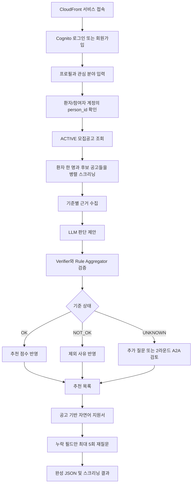
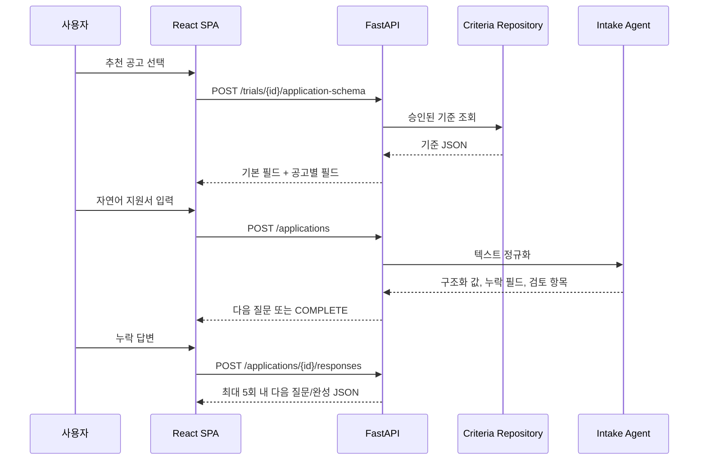
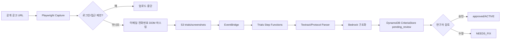
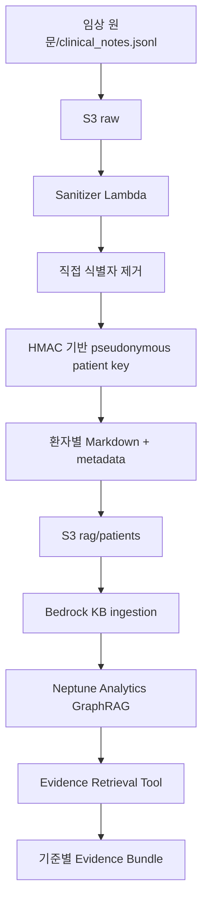
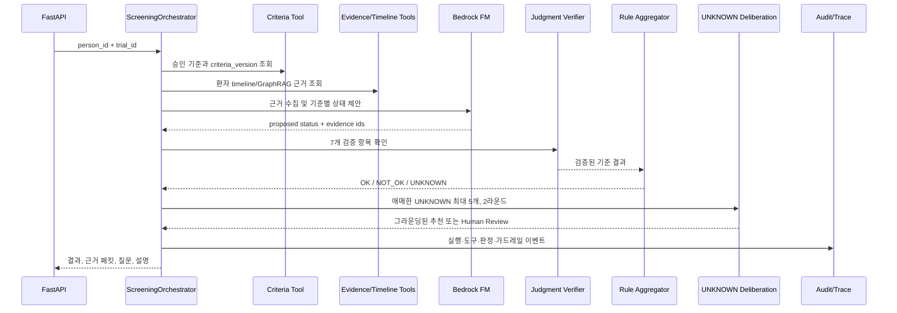
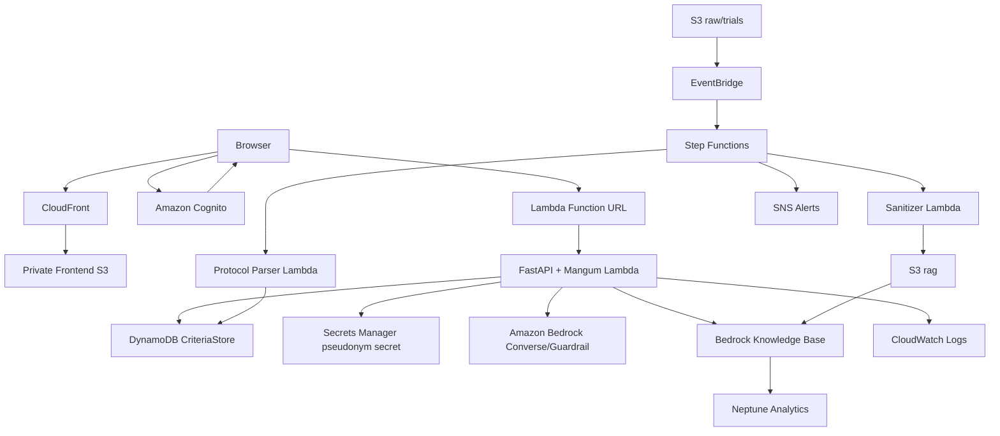

# AWS Healthcare Clinical Trial Matching

환자 임상정보와 임상시험 모집공고를 연결해 공고별 선정·제외 기준을 평가하고,
추천 결과와 근거, 추가 확인 질문, 감사 기록을 함께 제공하는 AWS 기반 임상시험
매칭 서비스입니다.

이 README는 프로젝트의 최상위 운영 문서입니다. 다음 내용을 한 번에 설명합니다.

- 사용자가 서비스를 이용하는 전체 흐름
- 모집공고와 환자 데이터가 처리되는 데이터 흐름
- 현재 AWS에 실제 배포된 아키텍처와 목표 아키텍처의 차이
- 런타임 에이전트, Tool, 결정론적 판정 계층의 역할
- 프로젝트에서 정의한 크롤링 Skill과 개발·배포 과정에서 사용한 Codex Skill
- 로컬 실행, 테스트, Git 브랜치 운영, AWS 배포와 장애 확인 절차

> 이 시스템은 의료진의 최종 판단을 대체하지 않습니다. 모델이 생성한 문장은
> 설명과 정보 수집을 돕는 보조 결과이며, 최종 적격성 상태는 검증된 근거와
> 결정론적 규칙으로 확정합니다.

## 1. 현재 서비스 상태

| 대상 | 값 |
|------|----|
| 운영 브랜치 | `deployment` |
| 프론트엔드 | <https://d2sajombqek5ru.cloudfront.net> |
| Matching API | `https://3fotb3ilzmnopf6gvflmequl440rmaxi.lambda-url.ap-northeast-2.on.aws` |
| API 헬스체크 | 위 API 주소 + `/health` |
| 기본 리전 | 서울 `ap-northeast-2` |
| GraphRAG 리전 | 오리건 `us-west-2` |
| 인증 | Amazon Cognito ID Token |
| 프론트 호스팅 | 비공개 S3 + CloudFront OAC |
| API 런타임 | FastAPI + Mangum + AWS Lambda Function URL |
| IaC | AWS CDK + CloudFormation |

운영 프론트엔드는 정적 SPA입니다. 별도의 `uvicorn` 프로세스가 상시 실행되는
구조가 아닙니다. 브라우저는 CloudFront에서 React 번들을 받고, API 요청은 Lambda
Function URL로 보냅니다. Lambda가 요청 시 기동되므로 서버 인스턴스를 계속 켜둘
필요가 없습니다.

## 2. 핵심 설계 원칙

1. **기준 JSON이 Source of Truth입니다.** 공고 원문이나 LLM의 기억이 아니라,
   검토·승인된 선정/제외 기준 JSON을 실제 판정 입력으로 사용합니다.
2. **LLM은 최종 적격성을 결정하지 않습니다.** LLM은 근거 수집 계획, 기준별 상태
   제안, 설명, 확인 질문을 만들 수 있지만 상태 확정은 규칙 계층이 담당합니다.
3. **근거 ID 없는 결론은 통과하지 않습니다.** 설명과 판단은 사용한 근거 ID를
   제시해야 하며, Verifier가 날짜·단위·연산자·출처를 검사합니다.
4. **UNKNOWN은 실패가 아닙니다.** 정보 부족, 근거 충돌, 기준 해석의 불확실성을
   별도 상태로 유지하고 질문, A2A 검토, Human Review로 보냅니다.
5. **직접 식별자는 모델과 RAG에 보내지 않습니다.** 환자 문서는 비식별화 후에만
   GraphRAG 소스로 사용합니다.
6. **같은 입력과 같은 기준 버전은 같은 결과를 만들어야 합니다.** 수치 비교,
   기간 계산, 종합 상태 확정은 결정론적으로 수행합니다.
7. **AWS 인프라는 CDK가 기준입니다.** 콘솔에서 수동 변경한 설정은 다음 배포에서
   사라질 수 있으므로 코드에 반영해야 합니다.

## 3. 저장소 구조

```text
.
├── frontend/                  React + TypeScript + Vite SPA
├── backend/
│   ├── app.py                 CDK 애플리케이션 진입점
│   ├── infra/                 AWS 스택 정의
│   ├── lambdas/               공고·환자 데이터 파이프라인 Lambda
│   ├── step_functions/        EMR/공고 파이프라인 상태 머신
│   ├── lambda_api/            Mangum Lambda 어댑터
│   ├── scripts/               API 패키징·시드 데이터 생성
│   └── api/                   FastAPI 스크리닝 서비스
├── agent/                     모델·tool-use·판단 제안·설명 에이전트 계층
├── crawler/                   공개 모집공고 수집 및 캡처
├── rag/                       검색 문서·평가·질의 계층
└── doc/
    ├── ARCHITECTURE_V2.md     목표 아키텍처
    ├── MATCHING_MODEL_V2.md   데이터·판정 모델 상세
    └── DEPLOYMENT.md          실제 AWS 배포값과 운영 메모
```

의존성 방향은 `backend → agent` 한 방향입니다. `agent/`는 FastAPI나 AWS 저장소를
직접 import하지 않고 `agent/contracts.py`의 Protocol을 통해 필요한 기능을
요청합니다. 실제 구현은 `backend/api/app/container.py`가 주입합니다.

## 4. 전체 사용자 워크플로우



### 4.1 인증과 사용자 범위

- 브라우저는 Cognito에서 받은 ID Token을 `Authorization: Bearer ...`로 보냅니다.
- Lambda Function URL 자체는 `AuthType.NONE`입니다. 브라우저가 SigV4 서명을 할 수
  없기 때문이며, 실제 인증은 FastAPI의 Cognito 검증 계층이 담당합니다.
- 운영 Lambda에는 `AUTH_REQUIRED=true`가 설정됩니다.
- 일반 사용자는 Cognito의 `custom:person_id`와 일치하는 환자 데이터만 조회합니다.
- 관리자 API는 Cognito `admin` 그룹에 속한 사용자만 호출할 수 있습니다.
- CORS는 FastAPI 미들웨어 한 곳에서만 처리합니다. Function URL과 FastAPI 양쪽에
  CORS를 설정하면 브라우저가 중복 `Access-Control-Allow-Origin` 헤더를 거부합니다.

### 4.2 추천 실행

1. 프론트가 `/api/v1/trials`에서 승인된 공고를 조회합니다.
2. `/api/v1/recommendations/run`에 `person_id`, `top_k`, 선택 공고를 전달합니다.
3. `RecommendationOrchestrator`가 후보 공고를 최대 5개 worker로 병렬 처리합니다.
4. 각 공고는 동일한 `ScreeningOrchestrator` 경로를 통과합니다.
5. 규칙 상태와 A2A 추천 상태를 분리한 채 점수를 계산합니다.
6. 추천, 제외, 정보 부족 결과를 한 응답으로 반환합니다.
7. 후보가 0개인 경우도 오류가 아니라 빈 추천 결과와 worker 수 `0`을 반환합니다.

### 4.3 공고 기반 자연어 지원서

추천 공고를 선택하면 그 공고의 기준에서 질문 스키마를 파생합니다.



현재 지원서 세션은 Lambda 메모리의 `IntakeStore`에 저장됩니다. 따라서 다른 Lambda
인스턴스로 요청이 분산되거나 콜드 스타트가 발생하면 세션이 사라질 수 있습니다.
운영 완성형에서는 DynamoDB 또는 Redis 기반 영속 Store로 교체해야 합니다.

## 5. 모집공고 수집 워크플로우



수집 계층은 공개 페이지의 모든 결과를 저장하지 않습니다. 예약 페이지, 모집 종료,
AI 매칭 광고, 일반 헬스케어 서비스는 제외하고 실제 모집공고만 처리합니다.

공고 원문과 구조화 기준의 역할도 분리합니다.

| 데이터 | 역할 |
|--------|------|
| HTML/PDF/PNG 원문 | 감사, 재처리, 관리자 대조 |
| 표준화 공고 메타데이터 | 목록과 검색 |
| 승인된 Criteria JSON | 런타임 판정 Source of Truth |
| `pending_review` 기준 | 검토 전 임시 결과, 추천에 사용 금지 |

## 6. 환자 데이터와 GraphRAG 워크플로우



현재 기본 리전은 서울이지만 GraphRAG만 `us-west-2`에 있습니다. 서울 리전의
Bedrock Knowledge Bases가 프로젝트 배포 시점에 `NEPTUNE_ANALYTICS` 저장 유형을
지원하지 않아 생긴 제약입니다. 리전 간 이동 데이터는 비식별화가 끝난 문서로
제한합니다.

GraphRAG는 판정 원본이 아닙니다. 환자 근거와 표준문서 검색을 돕는 계층이며,
수치 비교와 선정/제외 기준의 진실 원본은 구조화 데이터와 Criteria JSON입니다.

## 7. 스크리닝 내부 아키텍처



### 7.1 상태 모델

내부 기준 상태와 API 표현은 다음 의미를 가집니다.

| 내부 상태 | API 의미 | 처리 |
|-----------|----------|------|
| `EVIDENCE_FOUND` | `OK` | 근거가 있고 기준을 충족 |
| `CONTRADICTED` | `NOT_OK` | 근거가 있고 기준과 충돌 |
| `UNKNOWN` | `UNKNOWN` | 필요한 관찰값이나 근거가 없음 |
| `CONFLICTING` | `UNKNOWN`/검토 | 복수 근거가 서로 충돌 |
| `REVIEW_REQUIRED` | `UNKNOWN`/검토 | 자동 확정 조건을 만족하지 못함 |

UNKNOWN은 자동으로 NOT_OK로 바꾸지 않습니다. 포함 기준의 정보 부족과 제외 기준의
부재는 의미가 다르며, 추가 질문 또는 검토로 남겨야 합니다.

### 7.2 LLM과 규칙의 책임 분리

| 작업 | LLM/Agent | 결정론적 코드 |
|------|-----------|---------------|
| 필요한 근거 종류 선택 | ✅ | 권한 범위 검증 |
| 자연어 이벤트 추출 | ✅ | span/날짜/단위/범위 검증 |
| 기준별 상태 제안 | ✅ | 최종 상태 확정 |
| 수치·기간 계산 | ❌ | ✅ |
| 선정/제외 연산자 평가 | ❌ | ✅ |
| 종합 적격성 결정 | ❌ | ✅ |
| 설명과 질문 작성 | ✅ | 금칙어·PII·근거 ID 검증 |

### 7.3 Tool Gateway

공고·기준·환자·RAG 조회는 독립 Agent가 아니라 권한이 제한된 Tool입니다.

| Tool | 역할 | 대표 구현 |
|------|------|-----------|
| Criteria Tool | 승인 공고와 버전별 기준 조회 | `criteria_tool.py` |
| Evidence Retrieval Tool | Bedrock KB 또는 로컬 근거 검색 | `evidence_retrieval.py` |
| Timeline Graph Tool | 환자 임상 이벤트 시간순 조회 | `timeline_graph.py` |
| Rule Evaluator | 수치, 범위, 기간, 연산자 평가 | `rule_evaluator.py` |

`ToolGateway`는 에이전트가 임의 AWS API나 DB를 호출하지 못하도록 허용 목록, 입력
스키마, 권한을 검사합니다.

## 8. 에이전트 목록

이 프로젝트에서 “에이전트”는 세 종류로 구분해야 합니다.

1. 서비스 런타임에서 호출되는 임상 매칭 에이전트
2. 모집공고 수집을 조정하는 크롤러 에이전트
3. 개발·검사·배포를 수행한 Codex 작업 에이전트

서로 같은 실행 계층이 아닙니다.

### 8.1 임상 매칭 런타임 에이전트

| 에이전트 | 책임 | 구현 | 실패 시 동작 |
|----------|------|------|--------------|
| Intake Agent | 자유 문장을 측정값·약물·이상반응·상태 이벤트로 정규화 | `agent/intake.py` | 규칙 추출 결과 유지 |
| Evidence Gathering Agent | 기준을 보고 필요한 Tool과 근거 수집 순서를 선택 | `agent/loop.py` | 로컬 검색/기본 실행 계획 |
| Criterion Judge | 기준별 `OK/NOT_OK/UNKNOWN` 상태를 제안 | `agent/judge.py` | 규칙 판정 승계 |
| Evidence Verifier | 근거와 기준의 의미 관계를 NLI 방식으로 검토 | `agent/verifier.py` | 로컬 Verifier 사용 |
| UNKNOWN Deliberation | 검토자·반론자 역할로 정확히 2라운드 교차 검토 | `agent/deliberation.py` | UNKNOWN/Human Review 유지 |
| Question Agent | 정보 가치가 높은 확인 질문을 최대 5개 생성 | `agent/narration.py` | 규칙 기반 질문 사용 |
| Result Explanation Agent | 근거와 사전 부적합 사유를 사용자 문장으로 설명 | `agent/narration.py` | 템플릿 설명 사용 |

`AgentManager`가 모델 클라이언트, Guardrail, Tool Gateway, 로컬 폴백을 조립합니다.
모델이 비활성화되거나 호출에 실패해도 가능한 경로는 결정론적 폴백으로 동작합니다.

### 8.2 별도 Agent로 만들지 않은 구성

| 이름 | 분리하지 않은 이유 | 실제 위치 |
|------|--------------------|-----------|
| Notice Agent | 단순 공고 조회는 추론이 아니라 데이터 접근 | Criteria Tool |
| Criteria Agent | 기준은 승인된 JSON 조회가 핵심 | Criteria Tool |
| Medical Record Agent | 환자 기록 조회는 권한 제한 Tool 책임 | Timeline/Evidence Tool |
| RAG Agent | Retrieve API 호출 자체는 Tool | Evidence Retrieval Tool |
| Rejection Reason Agent | 설명 에이전트와 책임 중복 | Result Explanation Agent |

### 8.3 Medi25 Crawler Agent

`crawler/medi25-crawler-agent.md`에 정의된 수집 오케스트레이터입니다.

- 질환 키워드 수신
- Medi25 검색
- 검색 결과 분류
- 모집 중인 공고만 선별
- Crawling Skill 실행
- 결과 메타데이터 검증
- 표준 JSON 반환

실제 공개 페이지 캡처는 `crawler/playwright_capture.py`가 담당합니다. 접근 제한 또는
로그인 화면은 업로드하지 않고 연락처를 마스킹한 뒤 S3로 전송합니다.

공개 목록 배치 수집 예시:

```bash
crawler/.venv/bin/python crawler/playwright_capture.py \
  --list-url "https://trialforme.konect.or.kr/clnctest/list.do" \
  --limit 10 \
  --delay-seconds 1.5 \
  --s3-bucket <HealthcareDataBucketName>
```

별도 상시 크롤링 서버는 필요하지 않습니다. 초기에는 로컬/운영 작업에서 이 명령을
실행하고, 자동화 단계에서는 EventBridge Scheduler가 Playwright 패키지를 포함한
Lambda 또는 짧게 실행되는 ECS Fargate Task를 호출하면 됩니다. 원문은 S3,
구조화 결과와 검토 상태는 DynamoDB, 검색용 비식별 문서는 Bedrock KB/Neptune에
저장합니다.

### 8.4 Codex 작업 에이전트

이 README 작성과 앞선 배포 작업에서는 별도 병렬 sub-agent를 생성하지 않았습니다.
하나의 Codex 주 에이전트가 저장소 검사, GitHub 확인, 테스트, CDK diff, AWS 배포,
CloudWatch 진단을 순서대로 수행했습니다. 서비스 런타임의 임상 에이전트와 Codex
개발 에이전트는 완전히 별개입니다.

## 9. Skill 목록과 사용 위치

### 9.1 프로젝트 내부 도메인 Skill

| Skill | 문서 | 역할 |
|-------|------|------|
| Medi25 Crawling Skill | `crawler/medi25-crawler-skill.md` | HTML 분석, 모집공고 필터링, 상세 페이지 방문, 메타데이터 추출·검증 |

이 Skill은 프로젝트가 정의한 업무 명세입니다. Codex 플러그인 Skill과는 형식과
실행 주체가 다릅니다.

### 9.2 개발·배포 과정에서 사용한 Codex Skill

| Skill | 사용 목적 | 실제 수행 내용 |
|-------|-----------|----------------|
| `github:github` | 저장소와 브랜치 상태 파악 | 원격 저장소, `deployment` 브랜치, PR 병합 상태, 커밋 관계 확인 |
| `github:yeet` | 변경 게시 절차 | 변경 범위 확인, 명시적 파일 stage, 커밋, `deployment` 푸시 |

다음 항목은 Skill이 아니라 실행 도구입니다.

| 도구 | 역할 |
|------|------|
| `git`, `gh` | 브랜치, 커밋, 원격 동기화, GitHub 인증 |
| AWS CLI | STS 계정 확인, CloudFormation 상태, CloudWatch 로그, S3/CloudFront 작업 |
| AWS CDK CLI | synth, diff, deploy |
| `pytest` | API와 Lambda 회귀 테스트 |
| npm/Vite/TypeScript | 프론트 의존성 설치, 타입 검사, 운영 번들 생성 |
| `curl` | 공개 URL, CORS, 헬스체크 검증 |

`gh-fix-ci`, `gh-address-comments`, 이미지 생성, Notion Skill은 이번 배포 흐름에서
사용하지 않았습니다.

## 10. 실제 AWS 아키텍처



### 10.1 CDK 스택

| 스택 | 리전 | 주요 리소스 |
|------|------|-------------|
| `HealthcareAuthStack` | 서울 | Cognito User Pool, SPA Client, admin 그룹 |
| `HealthcareS3Stack` | 서울 | KMS 암호화 데이터 레이크 |
| `HealthcareObservabilityStack` | 서울 | CloudWatch 대시보드, SNS |
| `HealthcareMainStack` | 서울 | CriteriaStore, Lambda, Step Functions, EventBridge, DLQ |
| `HealthcareGuardrailStack` | 서울 | Bedrock Guardrail |
| `HealthcareApiStack` | 서울 | FastAPI Lambda, Function URL, IAM |
| `HealthcareFrontendStack` | 서울 | 비공개 S3, CloudFront OAC, SPA fallback |
| `HealthcareGraphRagStack` | 오리건 | Neptune Analytics, Bedrock KB, 소스 S3, KMS |

### 10.2 프론트 캐시 정책

- 해시가 포함된 JS/CSS는 `max-age=31536000, immutable`로 업로드합니다.
- `index.html`은 `no-cache, no-store`로 마지막에 업로드합니다.
- 배포 후 CloudFront `/*` invalidation을 생성합니다.
- CloudFront는 SPA deep link를 위해 S3의 403/404를 `/index.html` 200으로 바꿉니다.
- S3 버킷은 공개하지 않고 CloudFront OAC로만 읽습니다.

## 11. 현재 구현과 목표 아키텍처의 차이

`doc/ARCHITECTURE_V2.md`에는 최종 목표도 포함되어 있습니다. 아래 항목은 문서에는
있지만 현재 운영 배포에는 완전히 구현되지 않았습니다.

| 항목 | 현재 상태 | 목표 |
|------|-----------|------|
| 환자 데이터 | 배포 패키지의 시드 환자 3명 | 실제 비식별 임상 이벤트 저장소 |
| Run/Application Store | Lambda 메모리 | DynamoDB 또는 Redis 영속화 |
| ElastiCache | 미배포 | 개인정보 JSON TTL 임시 처리 |
| 공고 DB | `CriteriaStore` 중심 | Notice/Criteria/Audit 테이블 분리 |
| GraphRAG 인덱스 | 인프라 연결, 실제 문서 부족 가능 | 정기 ingestion과 품질 평가 |
| 크롤러 자동 실행 | 수동 Playwright와 파이프라인 연결 | Scheduler 기반 정기 수집 |
| 자동 CI/CD | 없음, 현재 수동 CDK/S3 배포 | `deployment` push 기반 검증·배포 |
| 사용자 세션 | Lambda 메모리 일부 사용 | 콜드 스타트에 안전한 영속 세션 |

시드 데이터에는 실제 환자정보가 없으며 `SEED_PLACEHOLDER`로 구분됩니다. API 기동과
화면 흐름 검증용일 뿐 임상 품질 평가에 사용하면 안 됩니다.

## 12. 주요 API

| Method | Path | 설명 |
|--------|------|------|
| `GET` | `/health` | 데이터 수, RAG, 인증 모드 확인 |
| `GET` | `/api/v1/trials` | 승인된 모집공고 조회 |
| `GET` | `/api/v1/patients` | 접근 가능한 환자 목록 |
| `POST` | `/api/v1/recommendations/run` | 후보 공고 전체 추천 실행 |
| `GET` | `/api/v1/recommendations/{id}` | 추천 결과 재조회 |
| `POST` | `/api/v1/screening/run` | 환자×공고 단건 스크리닝 |
| `GET` | `/api/v1/screening/{id}` | 실행 상세 조회 |
| `GET` | `/api/v1/screening/{id}/evidence` | 기준별 근거 패킷 |
| `POST` | `/api/v1/trials/{id}/application-schema` | 공고 기준 기반 지원서 스키마 생성 |
| `POST` | `/api/v1/applications` | 자연어 지원서 시작 |
| `POST` | `/api/v1/applications/{id}/responses` | 누락 질문 답변 |
| `POST` | `/api/v1/applications/{id}/screening` | 완성 지원서 스크리닝 |
| `POST` | `/api/v1/intake/normalize` | 자유 문장 이벤트 정규화 |
| `POST` | `/api/v1/patients/{id}/answers` | 확인 질문 답변 저장·정규화 |
| `POST` | `/api/v1/cohort/run` | 공고 기준 코호트 분석 |
| `GET` | `/api/v1/review-queue` | Human Review 대상 조회 |

전체 계약은 [backend/api/README.md](backend/api/README.md)를 참고하세요.

## 13. 로컬 실행

### 13.1 백엔드

macOS/Linux:

```bash
python3 -m venv backend/.venv
backend/.venv/bin/pip install -r backend/api/requirements.txt
backend/.venv/bin/python -m uvicorn app.main:app \
  --app-dir backend/api --reload --port 8000
```

PowerShell:

```powershell
python -m venv backend/.venv
backend/.venv/Scripts/python -m pip install -r backend/api/requirements.txt
backend/.venv/Scripts/python -m uvicorn app.main:app --app-dir backend/api --reload --port 8000
```

로컬 API는 <http://127.0.0.1:8000>, Swagger는 <http://127.0.0.1:8000/docs>입니다.

실데이터셋이 없다면 API 루트의 기본 경로가 아닌 시드 디렉터리를 준비하거나
프론트 목업 모드를 사용해야 합니다. 운영 Lambda 패키지는 빌드 스크립트가
자동으로 시드 데이터를 생성합니다.

### 13.2 프론트엔드

```bash
cd frontend
npm ci
npm run dev
```

주요 환경 변수:

```dotenv
VITE_API_BASE_URL=http://127.0.0.1:8000
VITE_USE_MOCK=false
VITE_DEMO_PERSON_ID=1
VITE_AUTH_PROVIDER=local
```

화면만 확인하려면 `VITE_USE_MOCK=true`를 사용할 수 있지만, 운영 배포는
`frontend/.env.production`의 실제 API와 Cognito 설정을 사용합니다.

## 14. 테스트

```bash
cd backend/api
../.venv/bin/python -m pytest tests -q
```

```bash
backend/.venv/bin/python -m pytest \
  backend/lambdas/protocol_parser/test_handler.py \
  backend/lambdas/sanitizer/test_graphrag_documents.py -q
```

```bash
cd frontend
npm run build
```

주의: API 전체 테스트 일부는 레포 밖의 `outputs/longitudinal_emr_v2` 실데이터셋을
전제로 합니다. 데이터셋 누락으로 인한 `FileNotFoundError`와 코드 회귀 실패를
구분해야 합니다.

## 15. Git 워크플로우

| 브랜치 | 역할 |
|--------|------|
| `deployment` | 현재 AWS 운영 배포 기준 |
| `dev` | 개발 통합 이력 |
| `main` | 저장소 기본 브랜치지만 현재 운영 기준과 다를 수 있음 |
| 기능 브랜치 | 기능 구현 후 PR로 `deployment` 또는 합의된 통합 브랜치에 반영 |

다른 환경에서 최신 운영 코드를 받을 때:

```bash
git switch deployment
git pull origin deployment
```

운영에 직접 핫픽스했다면 반드시 같은 변경을 Git에 커밋·푸시해야 합니다. 그렇지
않으면 다음 CDK 배포가 운영 핫픽스를 이전 코드로 되돌릴 수 있습니다.

## 16. AWS 배포 워크플로우

### 16.1 사전 확인

```bash
aws sts get-caller-identity
git status --short --branch
git rev-parse --short HEAD
```

운영 계정과 `deployment` 최신 커밋이 맞는지 확인합니다.

### 16.2 API Lambda 패키지

```bash
cd backend
scripts/build_api_asset.sh
```

이 스크립트는 Linux x86_64 Python 3.12 wheel, FastAPI 코드, `agent/`, Mangum
handler, 배포용 시드 데이터셋을 `backend/build/api_lambda`에 만듭니다.

### 16.3 CDK diff와 배포

GraphRAG 출력값을 컨텍스트로 전달해야 합니다. 실제 값은
`doc/DEPLOYMENT.md`에서 확인합니다.

```bash
cd backend
npx -y aws-cdk@latest diff HealthcareMainStack HealthcareApiStack \
  --app '.venv/bin/python app.py' \
  -c knowledge_base_id=<id> \
  -c data_source_id=<id> \
  -c graphrag_bucket=<bucket> \
  -c guardrail_id=<id> \
  -c guardrail_version=<version> \
  -c frontend_origin=<cloudfront-origin>
```

diff에서 삭제나 예상하지 못한 교체가 없는지 확인한 뒤 배포합니다.

```bash
npx -y aws-cdk@latest deploy HealthcareMainStack HealthcareApiStack \
  --app '.venv/bin/python app.py' \
  --require-approval never \
  <동일한 context 인자>
```

### 16.4 프론트 S3 + CloudFront 배포

```bash
cd frontend
S3_BUCKET=<FrontendBucketName> \
CLOUDFRONT_DISTRIBUTION_ID=<DistributionId> \
  scripts/deploy-s3.sh
```

### 16.5 배포 후 스모크 테스트

```bash
curl -fsS https://<api-host>/health
curl -I https://<cloudfront-host>/
curl -I https://<cloudfront-host>/results/example
```

CORS는 브라우저 Origin으로 실제 응답과 프리플라이트를 모두 확인합니다.

```bash
curl -i https://<api-host>/health \
  -H 'Origin: https://<cloudfront-host>'

curl -i -X OPTIONS https://<api-host>/api/v1/recommendations/run \
  -H 'Origin: https://<cloudfront-host>' \
  -H 'Access-Control-Request-Method: POST' \
  -H 'Access-Control-Request-Headers: authorization,content-type'
```

## 17. 장애 진단 Runbook

### 17.1 “백엔드에 연결할 수 없습니다”

1. `/health`가 200인지 확인합니다.
2. `frontend/.env.production`의 `VITE_API_BASE_URL`을 확인합니다.
3. 브라우저 Origin을 넣어 CORS 응답을 확인합니다.
4. `Access-Control-Allow-Origin`이 두 번 붙지 않았는지 확인합니다.
5. CloudWatch에서 실제 요청 경로와 상태를 확인합니다.

```bash
aws logs tail /aws/lambda/healthcare-matching-api \
  --since 20m --region ap-northeast-2 --format short
```

### 17.2 API 500

- CloudWatch traceback의 최초 애플리케이션 프레임을 확인합니다.
- FastAPI `ResponseValidationError`라면 반환 payload와 Pydantic response model을
  비교합니다.
- 수정 후 회귀 테스트, Lambda 패키지 재빌드, API Stack 재배포를 모두 수행합니다.

### 17.3 프론트가 이전 버전처럼 보임

- CloudFront의 `index.html`이 새 해시 JS를 가리키는지 확인합니다.
- S3 sync 후 invalidation이 생성됐는지 확인합니다.
- 브라우저에서 강력 새로고침합니다.
- Git push 여부와 AWS 직접 배포 여부는 별개임을 기억합니다. 수동 AWS 배포는
  push 없이도 반영되지만, 운영과 Git 이력이 어긋나므로 반드시 동기화해야 합니다.

## 18. 보안과 운영 주의사항

- 브라우저 번들에 들어가는 `VITE_*` 값은 비밀로 취급할 수 없습니다.
- Cognito SPA Client에는 client secret을 두지 않습니다.
- 직접 식별자, 원문 임상 JSON, 토큰을 로그에 남기지 않습니다.
- S3 원문과 데이터 레이크는 KMS/암호화 정책을 유지합니다.
- 운영 Function URL에서 `AUTH_REQUIRED=true`를 끄지 않습니다.
- `admin` 권한은 Cognito 그룹으로만 부여합니다.
- Neptune Analytics는 상시 과금 비중이 큽니다. 사용하지 않는 데모 환경은
  `doc/DEPLOYMENT.md`의 비용·삭제 절차를 확인합니다.
- GraphRAG의 결과만으로 적격성을 확정하지 않습니다.

## 19. 상세 문서

| 문서 | 내용 |
|------|------|
| [아키텍처 v2](doc/ARCHITECTURE_V2.md) | 목표 서비스 구조와 보안 원칙 |
| [매칭 모델 v2](doc/MATCHING_MODEL_V2.md) | 데이터 모델, 판단, UNKNOWN/A2A 상세 |
| [배포 현황](doc/DEPLOYMENT.md) | 실제 AWS 리소스, 리전, 비용, 운영값 |
| [Backend](backend/README.md) | 파이프라인과 FastAPI 구조 |
| [API](backend/api/README.md) | 인증, 계층, 전체 엔드포인트 계약 |
| [Agent](agent/README.md) | 에이전트 계약, 폴백, Tool-use 상세 |
| [Crawler](crawler/README.md) | 공고 필터링·캡처·S3 전달 |
| [Frontend](frontend/README.md) | 화면, 인증, 환경 변수, 정적 배포 |

## 20. 다음 우선순위

1. Lambda 메모리의 지원서/실행 Store를 DynamoDB 또는 Redis로 영속화
2. 승인 공고와 CriteriaStore 운영 데이터 적재 자동화
3. 크롤러 EventBridge Scheduler와 관리자 검토 UI 완성
4. 실제 비식별 EMR 데이터셋과 GraphRAG ingestion 연결
5. `deployment` push 기반 테스트·CDK diff·배포 CI/CD 구축
6. npm 취약점과 CDK deprecated API 정리
7. 사용자 흐름 E2E 테스트와 Cognito 테스트 계정 자동화
8. CloudWatch 알람, 비용 알림, 운영 대시보드 검증
