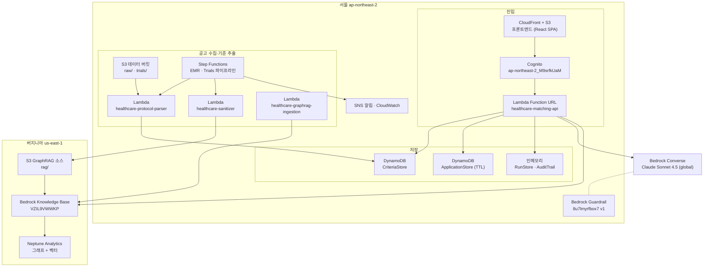

# 실제 구축 아키텍처 (as-built)

이 문서는 **지금 AWS에 실제로 배포되어 있는 것**을 기록한다. 목표 설계는
`ARCHITECTURE_V2.md`, 판정 모델 설계는 `MATCHING_MODEL_V2.md`에 있고 이 문서는
그것들과 다를 수 있다. 다른 부분은 마지막 절에 모아 두었다.

- 확인 시점: 2026-08-06
- 계정: `869515803312`
- 확인 방법: CloudFormation·DynamoDB·S3·Lambda·Bedrock·Cognito API 직접 조회

## 리전 구성

| 리전 | 역할 | 스택 |
|------|------|------|
| 서울 `ap-northeast-2` | 서비스 본체 | Api, Main, Frontend, Guardrail, Observability, S3, Auth |
| 버지니아 `us-east-1` | **GraphRAG (운영)** | GraphRag |
| 오리건 `us-west-2` | GraphRAG (구버전, 정리 대상) | GraphRag |

GraphRAG만 서울 밖에 있다. 선택이 아니라 제약이다 — Bedrock Knowledge Bases의
GraphRAG(`NEPTUNE_ANALYTICS` 스토리지)는 서울에서 제공되지 않는다.
[지원 리전](https://docs.aws.amazon.com/bedrock/latest/userguide/knowledge-base-build-graphs.html)은
프랑크푸르트·런던·아일랜드·오리건·버지니아·도쿄·싱가포르뿐이다.

따라서 서울 → 버지니아 교차 리전 호출이 하나 있다. 그 경계는 두 환경 변수로
명시한다.

```
KNOWLEDGE_BASE_REGION = us-east-1
S3_RAG_REGION         = us-east-1
```

## 전체 구성



## 저장소별 데이터

### DynamoDB `CriteriaStore` (서울)

공고에서 추출한 선정·제외 기준. 판정의 기준 원본이다.

| 항목 | 값 |
|------|-----|
| 파티션 키 | `trial_id` |
| 정렬 키 | `source_key` (S3 원본 경로) |
| GSI | `status-index` (`status` + `created_at`) |
| 현재 항목 수 | 18 |

필드: `trial_id`, `source_key`, `status`, `trial_title`, `phase`, `condition`,
`intervention`, `inclusion_criteria`(JSON 문자열), `exclusion_criteria`,
`inclusion_count`, `exclusion_count`, `created_at`, `updated_at`

`status`는 `pending_review` → `approved` 로 넘어간다. 매칭은 `approved` 만 쓴다.

### DynamoDB `ApplicationStore` (서울)

지원서 스키마와 작성 세션. `record_id` 접두어로 세 종류를 구분한다.

| `record_id` 형식 | 내용 |
|------|------|
| `NOTICE-FIELDS-<공고>-<해시>` | 공고에서 뽑은 동적 질문 필드 |
| `APP-SCHEMA-<공고>-<해시>` | 확정된 JSON Schema (내용 해시로 버전 고정) |
| `APP-<uuid>` | 지원자 작성 세션과 답변 |

필드: `record_id`, `record_type`, `payload`, `updated_at`, `expires_at`

**`expires_at` 으로 TTL이 걸려 있다.** 목표 설계가 ElastiCache에 맡기려던 개인정보
임시 보관을 DynamoDB TTL로 대신하고 있다. ElastiCache는 배포되지 않았다.

### S3

| 버킷 | 리전 | 경로 | 내용 |
|------|------|------|------|
| `healthcares3stack-healthcaredatabucket...` | 서울 | `raw/` | 원본 입력 |
| 같은 버킷 | 서울 | `trials/documents/*.txt` | 공고 텍스트 (기준 추출 성공 경로) |
| 같은 버킷 | 서울 | `trials/screenshots/*.png` | 공고 스크린샷 (아래 결함 참고) |
| `healthcaregraphragstack-graphragsourcebucket...96pg` | **버지니아** | `rag/` | GraphRAG 소스 문서 |
| `healthcarefrontendstack-frontendbucket...` | 서울 | `assets/` | SPA 빌드 산출물 |

KMS 암호화. `raw/` 는 Glacier 수명주기 규칙이 걸려 있다.

### Bedrock Knowledge Base (버지니아)

| 항목 | 값 |
|------|-----|
| KB ID | `VZIL9VWWKP` |
| 이름 | `healthcare-public-reference-graphrag` |
| 스토리지 | `NEPTUNE_ANALYTICS` |
| 상태 | ACTIVE |

이름이 `public-reference` 인 것이 중요하다. **공개 공고·표준문서 검색용이고 환자
개인 근거 저장소가 아니다.** 그래서 API의 검색 호출에 환자 가명 키 필터나
Secrets Manager 조회가 필요하지 않다.

### 인메모리 (영속화 안 됨)

| 대상 | 구현 |
|------|------|
| 매칭 실행 이력 | `app/persistence/run_store.py` `RunStore` |
| 판정 보고서·근거 패킷 | 같은 클래스 |
| 검토 큐 (Human Review) | 같은 클래스 |
| 감사 로그 | `app/persistence/audit.py` `AuditTrail` |

`container.py` 에 `run_store = RunStore()` 로 고정되어 있어 환경 변수로 교체할 수
없다. Lambda 컨테이너가 재활용되는 동안만 남고 콜드 스타트되면 사라진다.

### Cognito (서울)

| 항목 | 값 |
|------|-----|
| User Pool | `ap-northeast-2_M9srfkUaM` (`trial-matching-users`) |
| 클라이언트 | `12tvibdc3s1lc7f5ep4c5h0dko` |
| 관리자 그룹 | `admin` |
| 사용자 수 | 3 |

`AUTH_REQUIRED=true` 이므로 `/api/v1/*` 는 ID 토큰을 요구한다.

## Lambda 구성

| 함수 | 런타임 | 메모리 | 타임아웃 | 역할 |
|------|--------|--------|----------|------|
| `healthcare-matching-api` | python3.12 | 2048 MB | 300s | FastAPI. 판정·지원서·추천 API |
| `healthcare-protocol-parser` | python3.12 | 512 MB | 300s | 공고 → 기준 JSON (Textract + Bedrock) |
| `healthcare-sanitizer` | python3.12 | 1024 MB | 300s | 비식별화, GraphRAG 문서 생성 |
| `healthcare-graphrag-ingestion` | python3.12 | 256 MB | 120s | KB 동기화 작업 실행 |

`HealthcareA2AStack`(Reviewer·Challenger 독립 Lambda)은 **코드와 CDK는 완성됐으나
아직 배포되지 않았다.** API의 `A2A_REVIEWER_URL`·`A2A_CHALLENGER_URL` 이 비어 있어
A2A 토론은 같은 프로세스 안에서 두 역할을 순차 호출하는 경로로 동작한다.

## 모델과 안전장치

| 항목 | 값 |
|------|-----|
| 모델 | `global.anthropic.claude-sonnet-4-5-20250929-v1:0` |
| 호출 리전 | 서울 (Converse API 실호출 검증 완료) |
| 최대 토큰 | 1536 |
| Guardrail | `8u7lmyrfbox7` v1 |
| Guardrail 정책 | PII(NAME·EMAIL·PHONE·ADDRESS·카드·계좌) BLOCK, 주민번호 정규식 BLOCK, AGE ANONYMIZE, 의료 조언 주제 DENY, PROMPT_ATTACK 입력 HIGH |

Guardrail은 현재 `shared_model` 하나에 붙어 판단·검증·토론·설명·지원서 추출에
모두 적용된다. 측정 결과 판정 계층에서는 손실만 발생했다(아래 참고).

## 판정 흐름

```
승인된 공고 기준 (CriteriaStore, status=approved)
        +
지원서 JSON (ApplicationStore) → PATIENT_REPORTED 관찰값으로 승격
        +
GraphRAG 검색 (버지니아 KB, 공개 문서)
        ↓
rule_evaluator          수치·단위·범위 결정론적 계산
        ↓
LLM 판단 (criterion_judge)   OK / NOT_OK / UNKNOWN 제안
        ↓
JudgmentVerifier        7항목 검증
   V-EVIDENCE 근거 존재 · V-WINDOW 시간 범위 · V-UNIT 단위
   V-OPERATOR 연산자 · V-TYPE 기준 유형 · V-PII 개인정보 · V-CONFIDENCE 신뢰도
        ↓
RuleAggregator          최종 상태 확정
   일치+검증통과 → OK/NOT_OK (DECIDED)
   판단↔규칙 충돌 → UNKNOWN (A2A)
   검증 실패·제외기준 근거부족 → UNKNOWN (HUMAN_REVIEW)
        ↓
A2A 토론 (미해소 기준 최대 5개, 2라운드)
        ↓
OK / NOT_OK / UNKNOWN + 근거 패킷
```

모든 Tool 호출은 `ToolGateway`(`app/orchestration/gateway.py`)를 경유한다. Tool이
선언한 권한 밖을 정책으로 허용하려 하면 등록 단계에서 거부된다.

| Tool | 권한 | 모델 노출 |
|------|------|-----------|
| `criteria_tool` | `READ:dynamodb:trial_definitions` | X |
| `evidence_retrieval_tool` | `READ:bedrock:knowledge_base` | O |
| `timeline_graph_tool` | `READ:neptune:patient_timeline` | O |
| `rule_evaluator` | 없음 (계산 전용) | X |

## 측정된 성능

실제 Bedrock 호출로 측정했다. 스크립트는
`backend/scripts/evaluate_adversarial_a2a.py`.

### TrialGPT 전문가 라벨 70건 (2회 실행)

| 지표 | 프롬프트 v1.0 | v1.1 |
|------|---------------|------|
| 정확도 (확정 가능 46건) | 52.2% | 43.5% |
| 합의율 | 87.1% | 72.9% |
| 근거 인용률 | 67.1% | 70.0% |
| 이유 생성률 | 100% | 100% |
| 유효 합의율 | 54.3% | 42.9% |
| 과잉보류 | 22 | 26 |
| 잘못된 확정 | 4 | **0** |

혼동행렬에서 방향 오류(OK↔NOT_OK)는 0건이다. 오류는 전부 보류 쪽으로 샌다.
v1.1은 정확도를 8.7%p 잃고 잘못된 확정을 4건 → 0건으로 줄였다.

### 자체 적대적 세트 44건 (3회 실행)

| 지표 | 값 |
|------|-----|
| 정확도 (확정 가능 24건) | 평균 93.1% (87.5~100%, 폭 12.5%p) |
| 보류율 (보류 정답 20건) | 80% |
| 실행 간 흔들린 케이스 | 4/44 (9.1%) |

`temperature=0` 이라도 실행마다 결과가 바뀐다. 흔들리는 방향은 항상 확정 → 보류다.

### Guardrail을 판정 계층에 붙였을 때

| | 없음 | 전체 평가 | 근거만 평가 |
|---|---|---|---|
| 정확도 | 95.8% | 75.0% | 79.2% |
| 막아낸 위험 | — | 0건 | 0건 |

`guardContent` 로 검사 범위를 근거 서술로 좁혀도 이득이 없었다. **판정 계층에는
Guardrail을 붙이지 않는 것이 측정 결과에 부합한다.** 입력·출력 경계에서는 계속
사용한다.

## 목표 설계와 다른 점

`ARCHITECTURE_V2.md` 대비 미구현·상이 항목이다.

| 목표 | 현재 |
|------|------|
| `TrialNoticeTable` | 없음. `CriteriaStore` 가 공고 메타까지 겸한다 |
| `TrialCriteriaTable` (`trial_id` + `criteria_version`) | `CriteriaStore` 정렬 키가 `source_key` 다. 재파싱이 버전 증가가 아니라 새 항목으로 쌓인다 |
| `UserProfileTable` | 없음. 관심 질환·지역 기반 1차 후보 좁히기도 없다 |
| `PatientClinicalEventTable` | 없음. `timeline_graph_tool` 은 로컬 CSV를 읽으므로 배포 환경에서는 동작하지 않는다 |
| `MatchingRunTable` · `MatchingReportTable` | 없음. 인메모리 |
| `AdminAuditLogTable` | 없음. 인메모리 |
| ElastiCache 임시 처리 계층 | 없음. `ApplicationStore` TTL이 대신한다 |
| `Refresh 모집공고` API | 없음. 크롤러는 독립 스크립트다 |
| 공고 최신성 확인 (`content_hash`, `last_checked_at`) | 없음 |
| 독립 A2A Lambda | 서울 Reviewer·Challenger 런타임으로 운영 배포 |
| — | `ApplicationStore` 는 목표 설계에 없던 추가 구성이다 |

## 알려진 결함

### 1. 스크린샷 기준 추출이 전부 실패한다

`protocol_parser` 가 `textract.detect_document_text` 를 쓰는데 **이 API는 한국어를
지원하지 않는다.** 한글 공고 스크린샷을 넣으면 글자를 라틴 문자로 오인식한다.

| 입력 | 건수 | 기준 0건 | 평균 기준 수 |
|------|------|----------|--------------|
| `trials/documents/*.txt` | 7 | 0 | 18.3 |
| `trials/screenshots/*.png` | 11 | 5 | 0.8 |

같은 공고를 두 경로로 넣은 결과가 이렇게 갈린다.

```
documents/kct_695402a17ea5.txt        4,629자  기준 26건  한글 정상
screenshots/kct_695402a17ea5_...png    514자  기준  0건  "YYXOB", "Polly olo" 등
```

2차 문제가 더 위험하다. 핸들러의 차단 조건이 `len(text) < 50` 이라 514자는
통과하고, 빈 기준이 `status=pending_review` 로 저장되어 **정상 항목처럼 보인다.**
같은 `trial_id` 에 정상 항목과 망가진 항목이 나란히 존재하므로 매칭이 후자를
집으면 판정 불가가 된다.

조치 방향: 스크린샷을 기준 추출 입력에서 제외하고 감사용 원본으로만 보관한다.
계속 쓰려면 Bedrock 멀티모달로 교체한다. 그리고 기준 0건은 `pending_review` 가
아니라 `NEEDS_FIX` 로 기록하고, 한글 문자 비율로 OCR 실패를 판정한다.

### 2. GraphRAG 스택이 두 리전에 중복 배포되어 있다

| 리전 | KB | 이름 | 상태 |
|------|-----|------|------|
| 버지니아 | `VZIL9VWWKP` | `healthcare-public-reference-graphrag` | 운영본 |
| 오리건 | `JEGPQXQUUG` | `healthcare-patient-evidence-graphrag` | 구버전 |

Neptune Analytics는 시간당 과금이므로 오리건 스택은 정리해야 한다. 코드
기본값(`backend/app.py` 의 `GRAPHRAG_REGION`)도 버지니아로 맞춰야 배포된 값과
일치한다.

### 3. 판정 결과가 영속화되지 않는다

실행 이력·보고서·검토 큐·감사 로그가 인메모리다. 재실행 추적과 사람 검토가
콜드 스타트에서 끊긴다. `ApplicationStore` 가 이미 "같은 계약 + 환경 변수로 교체"
패턴을 쓰고 있으므로 `RunStore` 도 같은 방식으로 DynamoDB 어댑터를 붙일 수 있다.

### 4. 환자 임상 데이터 경로가 비어 있다

`PatientClinicalEventTable` 도 `patient/raw/` 도 없다. 현재 판정 근거는 지원서에서
받은 값과 공개 문서 검색뿐이다.

## 재현 방법

이 문서의 수치는 아래로 다시 확인할 수 있다.

```powershell
# 배포 상태
aws cloudformation list-stacks --region ap-northeast-2
aws dynamodb describe-table --table-name CriteriaStore --region ap-northeast-2
aws lambda get-function-configuration --function-name healthcare-matching-api --region ap-northeast-2

# Bedrock 실호출 점검 (읽기 전용, 모델 호출 비용 발생)
$env:AWS_REGION = "ap-northeast-2"
backend/.venv/Scripts/python agent/scripts/verify_bedrock.py `
  --model-id global.anthropic.claude-sonnet-4-5-20250929-v1:0

# 성능 측정
cd backend
.venv/Scripts/python scripts/evaluate_adversarial_a2a.py --mode local --repeat 3
.venv/Scripts/python scripts/evaluate_adversarial_a2a.py --mode local `
  --source trialgpt --dataset evaluation_data/trialgpt_criterion_sample.jsonl --repeat 2
```
