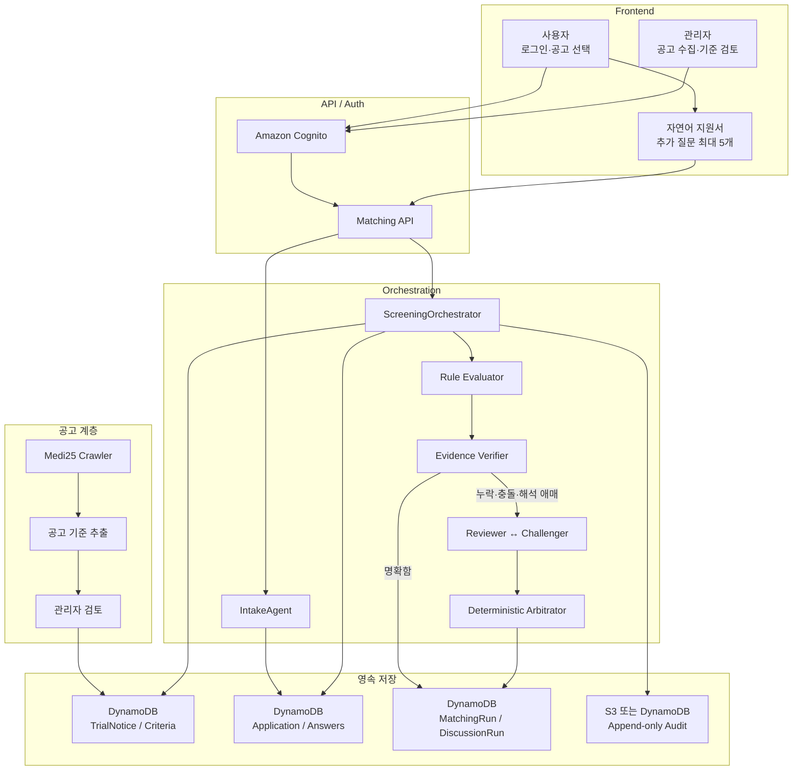
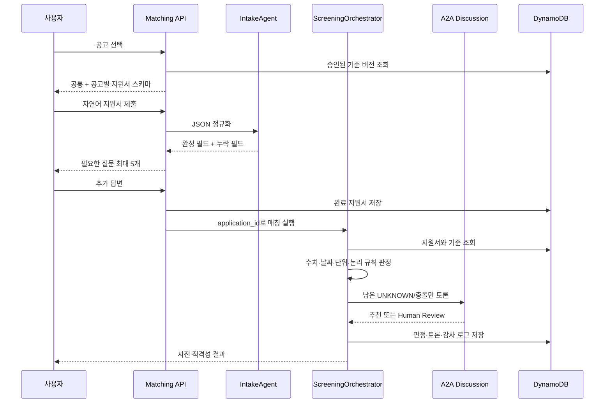
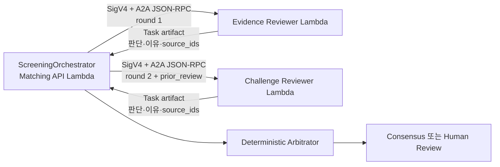

# 임상시험 매칭 아키텍처 v2

> **운영 결정 (2026-08-06):** 지연 시간 때문에 A2A는 운영 경로와 AWS 배포에서
> 제거했다. 이 문서의 A2A 다이어그램은 연구 기록으로만 남아 있으며, 운영에서
> `UNKNOWN`은 추가 질문 또는 Human Review로 전달한다.

이 문서는 2026-08-05 확정한 최종 데이터 원칙을 반영한 목표 아키텍처다.

## 최종 결정

서비스는 병원 EHR/EMR 연동이나 기존 환자 데이터셋을 요구하지 않는다. 사용자가
선택한 임상시험 공고의 승인된 선정·제외 기준과, 사용자가 직접 작성한 지원서 및
추가 답변만으로 사전 적격성을 검토한다.

이 시스템이 판단하는 것은 임상시험의 치료 효과나 참여 후 결과가 아니다. 반환값은
공고 기준에 대한 사전 검토 상태인 `OK`, `NOT_OK`, `UNKNOWN`이며 최종 등록 결정은
연구기관 담당자가 내린다.

### 사용하는 데이터

- Medi25 또는 관리자가 등록하고 승인한 임상시험 모집공고
- 공고에서 구조화하고 버전을 고정한 선정·제외 기준
- 사용자가 직접 작성한 공통 지원서와 공고별 추가 답변
- 사용자가 명시적으로 제출한 검사값·진단·약물·상태 정보
- 기준별 판단, A2A 토론, Human Review 이력

### 사용하지 않는 데이터

- 병원 EHR/EMR 직접 연동
- 기존 환자 타임라인 또는 환자 데이터 레이크
- Synthea 환자를 운영 입력이나 임상 정답으로 사용하는 방식
- 임상시험 참여 후 효능·안전성 결과를 적격성 정답처럼 사용하는 방식
- 환자 문서를 Neptune/GraphRAG에 적재하는 방식

현재 코드에 남아 있는 `person_id`, `DatasetRepository`, `TimelineGraphTool`, EMR
Step Functions, 환자 GraphRAG는 마이그레이션 대상인 레거시 구성이다.

## 전체 아키텍처



GraphRAG는 필수 구성요소가 아니다. 유지할 경우 공개 모집공고나 표준문서의 검색
보조 용도로만 사용하며 지원서 원문, 직접 식별자, 환자 문서는 넣지 않는다.

## 사용자 워크플로우



사용자가 모르는 검사값이나 과거 병력은 추측하지 않는다. 지원서와 추가 답변에
근거가 없으면 `UNKNOWN`으로 유지한다. A2A는 없는 정보를 만들어 내는 단계가 아니라,
주어진 답변의 충돌·시점·단위·기준 해석을 교차 검토하는 단계다.

## 공고 수집과 기준 승인

공고 유입 경로는 Medi25 수집, 관리자 URL·파일 업로드, 수동 입력이다. 모든 경로는
동일한 검토 절차를 통과한다.

1. 원문과 출처를 저장하고 콘텐츠 해시를 만든다.
2. LLM/Parser가 선정·제외 기준 후보를 구조화한다.
3. 스키마와 단위·연산자를 결정론적으로 검증한다.
4. 관리자가 기준을 승인하거나 수정한다.
5. 승인된 기준에 `criteria_version`을 부여하고 `ACTIVE`로 전환한다.

런타임의 Source of Truth는 공고 원문이나 LLM 출력이 아니라 관리자가 승인한 기준
JSON이다. 공고가 수정되면 기존 기준을 덮어쓰지 않고 새 버전을 만든다.

## 지원서 데이터 계약

지원서는 공통 필드와 공고 기준에서 파생한 추가 필드로 구성한다.

```json
{
  "application_id": "APP-1234",
  "owner_sub": "cognito-sub",
  "trial_id": "medi25-10713",
  "criteria_version": "sha256:...",
  "status": "COMPLETE",
  "answers": {
    "age": 54,
    "sex": "female",
    "diagnosed_conditions": ["제2형 당뇨병"],
    "current_medications": ["metformin"],
    "hba1c": {
      "value": 7.8,
      "unit": "%",
      "observed_at": "2026-07-20",
      "source": "USER_REPORTED"
    }
  }
}
```

직접 식별 정보는 지원 자격 JSON과 분리한다. 지원서 및 실행 접근 권한은 `person_id`가
아니라 Cognito `sub`와 `application_id`의 소유권으로 검사한다.

## 기준별 판정

각 기준은 다음 상태만 반환한다.

| 상태 | 의미 | 후속 처리 |
|---|---|---|
| `OK` | 제출된 근거가 기준을 충족 | 결과에 반영 |
| `NOT_OK` | 제출된 근거가 기준에 어긋남 | 사전 부적합 사유로 표시 |
| `UNKNOWN` | 정보 부족, 충돌, 해석 불가 | A2A 또는 Human Review |

수치, 범위, 날짜, 불리언, 명시적 목록 조건은 Rule Evaluator가 계산한다. LLM은
자연어 정규화와 애매한 기준의 해석을 제안할 수 있지만 결정론적 규칙 결과를 직접
덮어쓰지 못한다.

제외 기준에 정보가 없다고 해서 `OK`로 간주하지 않는다. 명시적 근거가 없으면
`UNKNOWN` 또는 Human Review다.

## 서버형 A2A 토론

Matching API와 분리된 두 Lambda가 A2A 1.0 Agent Card와 JSON-RPC 계약으로 통신한다.
두 함수는 같은 AWS 계정에 있지만 함수, 실행 역할, Function URL이 서로 독립적이다.
Function URL은 `AWS_IAM` 인증을 사용하고 Matching API 역할만 호출 권한을 갖는다.



각 에이전트는 `/.well-known/agent-card.json`에서 Agent Card를 제공하고 `/`에서
A2A JSON-RPC 요청을 받는다. Step Functions와 SQS는 긴 작업의 재시도·재개가 필요할
때 추가할 수 있지만, 그것 자체가 A2A 프로토콜은 아니다. 현재 동기 2라운드 경로는
Lambda 제한 시간 안에서 완료되도록 제한한다.

### DiscussionRun 최소 계약

```json
{
  "discussion_id": "DISC-1234",
  "matching_run_id": "RUN-1234",
  "criterion_id": "INC-HBA1C-01",
  "status": "ROUND_1",
  "round": 1,
  "criteria_version": "sha256:...",
  "application_version": 3,
  "allowed_source_ids": ["ANSWER-hba1c"],
  "messages": [],
  "version": 1
}
```

향후 토론 로그를 영속화할 때 `discussion_id + round + agent_id`를 멱등성 키로 사용한다.
토론은 최대 2라운드, 공고당 최대 5개 기준에서 종료한다. 두 역할이 같은 결론을
내더라도 허용된 답변 ID를 인용하지 못하면 합의로 인정하지 않는다.

토론 종료 결과는 추천 상태에만 반영하며 원래 규칙 상태를 보존한다. 불일치, 무근거,
타임아웃, 형식 오류는 `UNKNOWN`과 Human Review로 종료한다.

## 저장소 설계

| 저장소 | 데이터 | 역할 |
|---|---|---|
| DynamoDB `TrialNoticeTable` | 공고, 상태, 출처 | 공고 목록과 버전 관리 |
| DynamoDB `TrialCriteriaTable` | 승인 기준 JSON | 판정 Source of Truth |
| DynamoDB `ApplicationTable` | 지원서, 답변, 소유자 | 사용자 입력 영속화 |
| DynamoDB `MatchingRunTable` | 기준별 판정과 메타데이터 | 실행 재조회·재현 |
| DynamoDB `DiscussionRunTable` | A2A 라운드와 메시지 | 비동기 토론 재개·멱등성 |
| DynamoDB `ReviewQueueTable` | 사람 검토 대상 | 승인·반려·재실행 |
| S3 audit | append-only 이벤트 | 장기 감사 보존 |

ElastiCache는 지원서 세션에 필수적이지 않다. 현재 구현처럼 DynamoDB를 사용하고,
필요할 때만 단기 캐시로 추가한다.

## 평가 전략

실제 임상시험 결과 데이터는 평가 전제에 포함하지 않는다. 평가 단위는 승인된 기준과
통제된 합성 지원자 답변의 조합이다.

| 평가셋 | 평가 내용 |
|---|---|
| 공고 기준 추출 | 원문에서 필드·연산자·단위·기간 추출 |
| 지원서 정규화 | 자연어 답변을 근거가 있는 JSON으로 변환 |
| 누락 질문 | 필요한 정보만 최대 5개 질문 |
| 기준 판정 | 명확한 `OK/NOT_OK/UNKNOWN` |
| A2A | 누락·충돌·시점·단위·출처 검증 |
| 분산 실행 | 중복 메시지, 역순 도착, 타임아웃, 재시도 |

실제 임상 타당성을 주장하려면 별도로 전문가가 독립 판정한 환자-기준 쌍이 필요하다.
합성 규칙이 만든 라벨은 코드 회귀 테스트에는 쓸 수 있지만 임상 정확도의 근거로 쓰지
않는다.

## AWS 구성

| 계층 | AWS 서비스 |
|---|---|
| 인증 | Amazon Cognito |
| API | FastAPI on Lambda Function URL 또는 API Gateway |
| 공고 수집 | Lambda, EventBridge Scheduler, Step Functions |
| 공고·지원서·실행 | DynamoDB |
| A2A 오케스트레이션 | 독립 Lambda Function URL, A2A 1.0 JSON-RPC, IAM SigV4 |
| 모델 | Amazon Bedrock Converse API |
| 안전장치 | Bedrock Guardrails |
| 감사·관측 | CloudWatch, X-Ray, S3 append-only audit |
| 선택적 공개문서 검색 | Bedrock Knowledge Bases GraphRAG |

## 현재 구현에서의 마이그레이션 순서

1. `ApplicationTable`의 완료 JSON을 직접 받는 스크리닝 입력 계약을 추가한다.
2. `person_id` 없이 Cognito `sub + application_id`로 실행 소유권을 검증한다.
3. `DatasetRepository`, `TimelineGraphTool`, 환자 GraphRAG가 없어도 컨테이너가
   구성되도록 포트를 분리한다.
4. 실행·추천·감사 Store를 메모리에서 DynamoDB로 옮긴다.
5. `DiscussionRunTable`에 A2A 메시지와 결과를 영속화하고 필요 시 SQS로 비동기화한다.
6. 레거시 `/patients`, EMR Step Functions, sanitizer, 시드 환자 패키징을 제거한다.
7. 지원서 기반 평가셋으로 테스트를 교체하고 실제 Bedrock 모델을 검증한다.

## 보안 원칙

- 직접 식별자는 LLM, A2A 메시지, GraphRAG, 로그에 전달하지 않는다.
- 지원서 접근은 Cognito `sub` 소유권으로 통제한다.
- 각 모델에는 해당 기준에 필요한 최소 답변만 전달한다.
- 모델이 인용할 수 있는 답변 ID를 화이트리스트로 제한한다.
- 공고 기준 버전, 지원서 버전, 프롬프트 버전, 모델 ID를 실행마다 기록한다.
- 상태 변경은 append-only 감사 이벤트로 남긴다.
- 같은 입력과 같은 기준 버전의 결정론적 판정은 재현 가능해야 한다.
