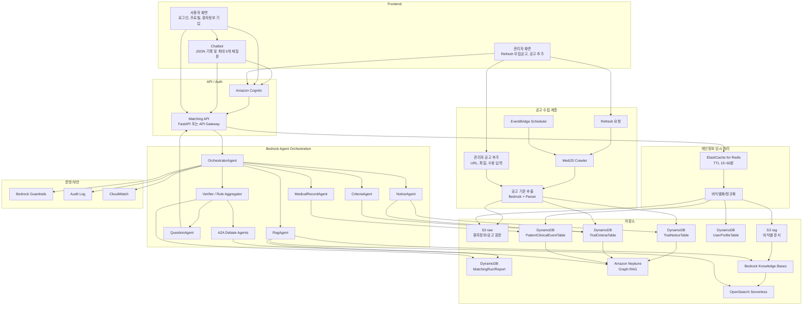
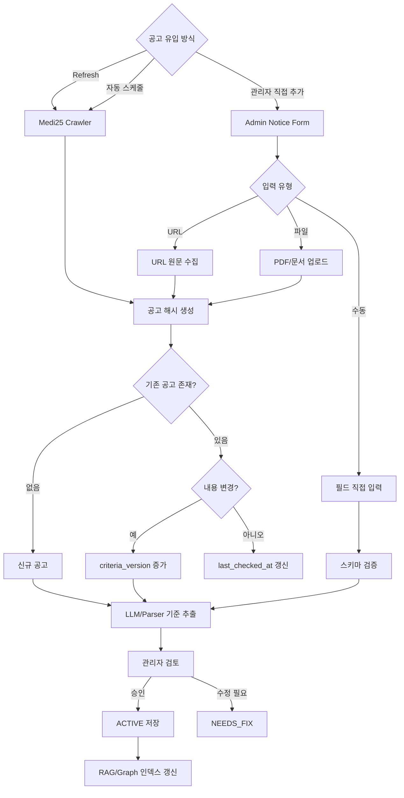
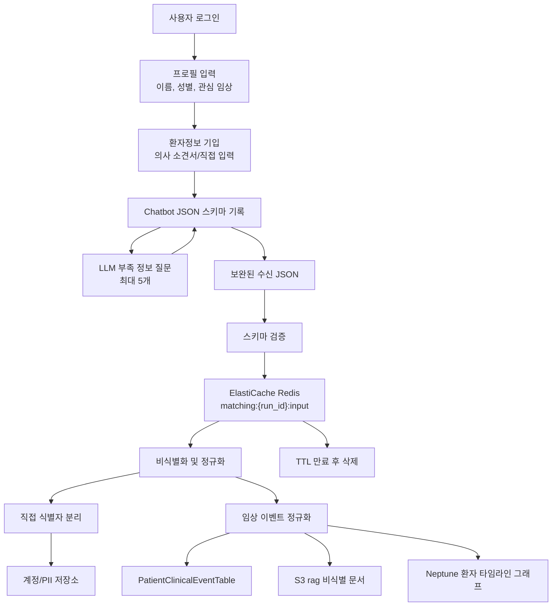
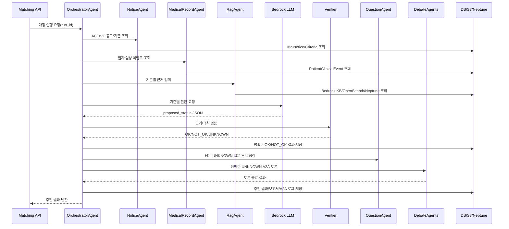
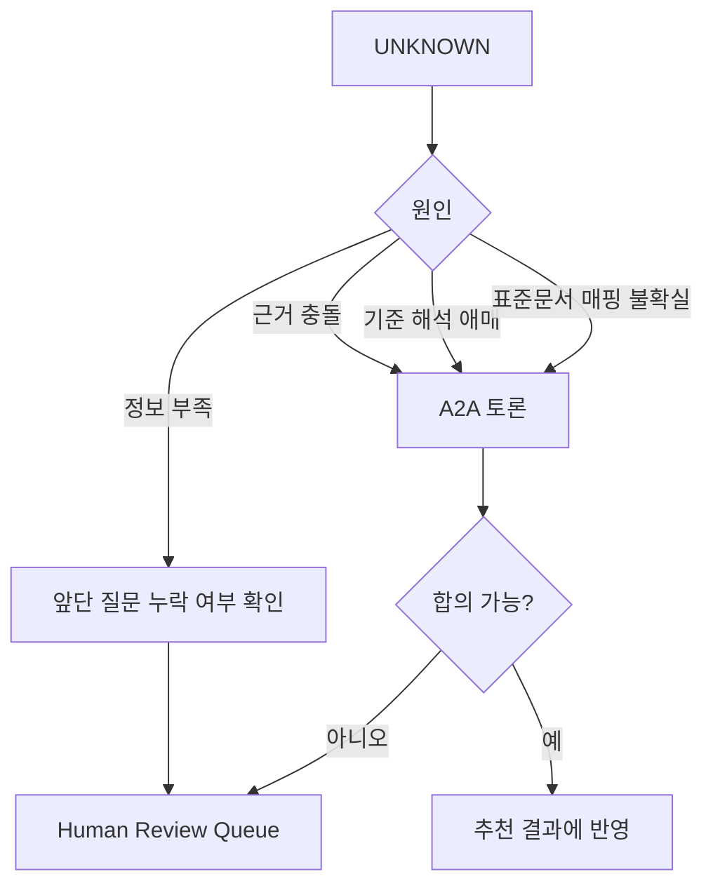

# 임상시험 매칭 아키텍처 v2

Medi25 모집공고, 관리자 수동 공고, 사용자 프로필, 환자정보 기입, 추가 설문을 하나의 워크플로우로 연결해 임상시험 추천 결과를 만드는 목표 아키텍처다.

핵심은 세 가지다.

- 워크플로우 시작점이 명확해야 한다: `Refresh 모집공고`, `공고 추가`, `매칭 시작`
- 개인정보 JSON은 장기 저장 전에 ElastiCache로 빠르게 전달하고 TTL 기반으로 임시 처리한다.
- 환자정보 기입 직후 LLM이 부족한 정보를 최대 5개까지만 먼저 질문하고, Bedrock LLM은 이후 기준별 판단을 제안한다.

## 전체 아키텍처



## 시작점

서비스 시작점은 세 가지로 둔다.

| 시작점 | 사용자 | 설명 | 결과 |
|--------|--------|------|------|
| `Refresh 모집공고` | 관리자/운영자 | Medi25 최신 모집공고를 가져와 DB와 인덱스를 갱신 | 공고 DB 최신화 |
| `공고 추가` | 관리자 | Medi25에 없거나 병원에서 별도 전달한 공고를 직접 등록 | 관리자 공고 등록 |
| `매칭 시작` | 일반 사용자 | 로그인 후 프로필과 환자정보 기입을 기반으로 추천 실행 | 추천 결과/보고서 |

이 구조가 필요한 이유는 전체 워크플로우가 사용자 입력만으로 시작되지 않기 때문이다. 공고 데이터는 운영자가 먼저 갱신할 수도 있고, 스케줄러가 자동으로 갱신할 수도 있으며, 관리자가 직접 추가할 수도 있다.

## 공고 수집 아키텍처



공고 상태:

| 상태 | 의미 |
|------|------|
| `DRAFT` | 관리자 입력 중 |
| `PENDING_REVIEW` | 기준 추출 결과 검토 대기 |
| `ACTIVE` | 매칭 대상 |
| `NEEDS_FIX` | 필수값 또는 기준 파싱 오류 |
| `ARCHIVED` | 매칭 제외 |

공고 저장 원칙:

- Medi25 자동 수집 공고와 관리자 추가 공고는 같은 테이블에 저장한다.
- `source_type`으로 출처를 구분한다: `MEDI25`, `ADMIN_URL`, `ADMIN_FILE`, `ADMIN_MANUAL`
- 공고가 수정되면 기존 기준을 덮어쓰지 않고 `criteria_version`을 증가시킨다.
- 관리자 추가/수정/승인/비활성화는 `AdminAuditLogTable`에 남긴다.

## 사용자 데이터 아키텍처

사용자에게 받은 JSON에는 개인정보가 포함될 수 있으므로, 전체 워크플로우 초반에는 ElastiCache를 임시 버퍼로 사용한다. 사용자가 환자정보를 기입하면 Chatbot이 먼저 JSON 스키마로 기록하고, LLM이 부족한 정보를 최대 5개까지 재질문한 뒤 비식별화와 정규화로 넘긴다.



Chatbot 처리 원칙:

| 항목 | 정책 |
|------|------|
| 입력 기준 | 선택된 공고의 선정/제외 기준 |
| 기록 방식 | 자연어 답변을 JSON 스키마로 정규화 |
| 부족 정보 판단 | LLM이 공고 기준과 환자정보 스키마의 누락 필드를 기반으로 판단 |
| 재질문 수 | 한 매칭 실행당 최대 5개 |
| 저장 방식 | 답변은 `SURVEY_ANSWER` 또는 임상 이벤트로 저장 |

ElastiCache 사용 정책:

| 항목 | 정책 |
|------|------|
| 용도 | 매칭 실행 중 수신 JSON 임시 전달 |
| 키 | `matching:{run_id}:input`, `matching:{run_id}:normalized` |
| TTL | 기본 15~60분 |
| 보안 | VPC 내부 접근, in-transit/at-rest encryption |
| 로그 | 원본 JSON 전체 로깅 금지 |
| 영구 저장 | 비식별화 후 목적별 저장소로 분리 |

## 저장소 설계

| 저장소 | 데이터 | 역할 |
|--------|--------|------|
| ElastiCache for Redis | 수신 개인정보 JSON, 정규화 중간 결과 | 빠른 임시 처리 |
| S3 `trials/raw/` | 공고 원문 HTML/PDF/문서 | 원본 보존 |
| S3 `patient/raw/` | 의사 소견서/환자정보 원문 | 암호화 원본 보존 |
| S3 `rag/` | 비식별 문서 chunk | Bedrock KB 소스 |
| DynamoDB `TrialNoticeTable` | 공고 목록, 상태, 출처 | 공고 조회 |
| DynamoDB `TrialCriteriaTable` | 선정/제외 기준, 버전 | 기준 판정 |
| DynamoDB `UserProfileTable` | 관심 임상, 성별, 생년 등 | 1차 후보 필터 |
| DynamoDB `PatientClinicalEventTable` | 검사, 진단, 약물, 설문 이벤트 | 구조화 근거 |
| DynamoDB `MatchingRunTable` | 매칭 실행 이력 | 재조회/재실행 |
| DynamoDB `MatchingReportTable` | 최종 보고서 메타데이터 | 사용자/관리자 조회 |
| DynamoDB `AdminAuditLogTable` | 관리자 공고 변경 이력 | 감사 |
| Amazon Neptune | 환자-이벤트-기준-표준문서 그래프 | Graph RAG |
| OpenSearch Serverless | 벡터/키워드 인덱스 | RAG 검색 |
| Bedrock Knowledge Bases | 비식별 문서 검색 | 근거 검색 |

## 에이전트 오케스트레이션



에이전트 책임:

| 에이전트 | 책임 | 주요 Tool |
|----------|------|-----------|
| `OrchestratorAgent` | 실행 계획, 후보 공고 선택, 전체 순서 제어 | 전체 tool gateway |
| `NoticeAgent` | 공고/기준 조회, 관리자 공고 포함 | `get_trial_notice`, `get_trial_criteria` |
| `MedicalRecordAgent` | 환자정보/의사 소견서 기반 구조화 이벤트 조회 | `query_timeline_graph` |
| `RagAgent` | 표준문서, 환자정보, 공고 원문 근거 검색 | `search_rag_evidence` |
| `CriteriaAgent` | 기준 문장 해석, 판단 입력 구성 | Criteria Store |
| `QuestionAgent` | 환자정보 기입 직후 부족 정보 질문 생성, 최대 5개 제한 | profile, missing fields |
| `A2A Debate Agents` | 애매한 기준을 제한 라운드로 토론하고 추천/검토로 종료 | evidence bundle |
| `Verifier` | LLM 제안 검증 및 최종 상태 확정 | `evaluate_rule`, Guardrails |

## LLM 판단 구조

LLM은 최종 적격성을 직접 결정하지 않는다. 기준별 상태를 제안하고, Verifier가 근거와 규칙을 검증해 최종 상태를 확정한다.

LLM 입력:

```json
{
  "task": "evaluate_trial_criterion",
  "patient_key": "pt_7f3a",
  "trial_id": "medi25-10713",
  "criterion": {
    "criterion_id": "inc_hba1c_001",
    "type": "INCLUSION",
    "raw_text": "최근 HbA1c 7.0% 이상",
    "field": "hba1c",
    "operator": ">=",
    "value": 7.0,
    "unit": "%",
    "time_window_days": 180
  },
  "evidence": [
    {
      "evidence_id": "patient.note_20260720_01",
      "source_type": "DOCTOR_NOTE",
      "observed_at": "2026-07-20",
      "text": "HbA1c 7.8%",
      "structured_value": 7.8,
      "unit": "%"
    }
  ],
  "allowed_status": ["OK", "NOT_OK", "UNKNOWN"]
}
```

LLM 출력:

```json
{
  "criterion_id": "inc_hba1c_001",
  "proposed_status": "OK",
  "confidence": 0.91,
  "reason": "최근 180일 이내 HbA1c 7.8% 근거가 있어 기준을 충족합니다.",
  "used_evidence_ids": ["patient.note_20260720_01"],
  "missing_information": [],
  "needs_a2a": false
}
```

Verifier 확정 규칙:

| 조건 | 최종 상태 |
|------|-----------|
| 근거가 존재하고 날짜/단위/연산자 검증 통과 | `OK` 또는 `NOT_OK` |
| 근거가 없거나 필수 정보가 부족 | `UNKNOWN` |
| LLM 제안과 규칙 결과가 충돌 | A2A 토론 대상으로 분류 |
| A2A 합의 가능 | 토론 결과를 추천 점수와 기준 상태에 반영 |
| A2A 후에도 합의 불가 | Human Review |
| 출력에 직접 식별 정보 포함 | 차단 후 재생성 |

재질문은 매칭 실행 전에 정보 가치가 높은 순서로 최대 5개만 생성한다. 매칭 이후 남는 질문 후보는 사용자에게 바로 묻기보다 A2A 또는 Human Review 대상으로 넘긴다. A2A는 다시 Verifier로 순환하지 않고 토론 종료 결과를 추천 또는 검토 큐에 반영한다.

## UNKNOWN 처리



`UNKNOWN`은 실패가 아니라 추가 정보 수집 또는 검토 상태다. 사용자 재질문은 앞단에서 최대 5개까지만 수행하고, 매칭 이후 남은 `UNKNOWN`은 A2A 토론과 Human Review 중심으로 처리한다. A2A 결과는 추천으로 바로 반영하거나 검토 큐로 종료해야 하며 재귀 루프를 만들지 않는다.

## AWS 구성 요약

| 계층 | AWS 서비스 |
|------|------------|
| 인증 | Amazon Cognito |
| API | API Gateway 또는 FastAPI on ECS/Lambda |
| 공고 수집 | Lambda, EventBridge Scheduler, Step Functions |
| 임시 개인정보 처리 | ElastiCache for Redis |
| 원문 저장 | S3 + KMS |
| 공고/기준/실행 결과 | DynamoDB |
| Graph RAG | Amazon Neptune |
| RAG 검색 | Bedrock Knowledge Bases + OpenSearch Serverless |
| 모델 판단 | Amazon Bedrock Converse API |
| 에이전트 | Bedrock Agents 또는 자체 Orchestrator |
| 안전장치 | Bedrock Guardrails |
| 감사/관측 | CloudWatch, X-Ray, S3 append-only audit |

## 구현 우선순위

1. 관리자 `Refresh 모집공고`와 `공고 추가` 화면/API 정의
2. `TrialNoticeTable`, `TrialCriteriaTable`, `AdminAuditLogTable` 스키마 확정
3. ElastiCache 수신 JSON 키/TTL/암호화 정책 확정
4. 사용자 프로필과 환자 임상 이벤트 JSON 스키마 확정
5. 공고 기준 추출 및 관리자 검토 플로우 구현
6. Graph RAG 노드/엣지 모델 구현
7. Bedrock tool-use 오케스트레이션 구현
8. `OK`, `NOT_OK`, `UNKNOWN` Verifier 구현
9. `UNKNOWN` 질문 생성과 A2A 토론 로그 구현
10. 최종 보고서 저장과 조회 API 구현

## 보안 원칙

- 직접 식별자는 LLM, RAG, 로그에 전달하지 않는다.
- ElastiCache는 임시 처리 계층이며 TTL 만료 후 삭제한다.
- 모든 원문 데이터는 S3 + KMS로 암호화한다.
- 모든 공고 추가/수정/판정 변경은 감사 로그에 남긴다.
- 같은 입력과 같은 기준 버전에서는 같은 판정이 재현되어야 한다.
