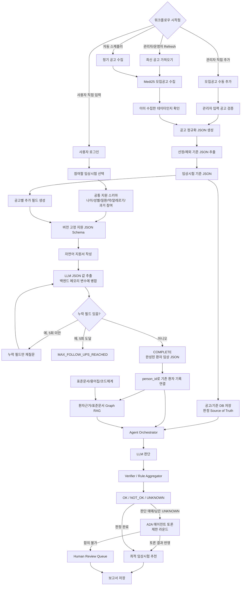
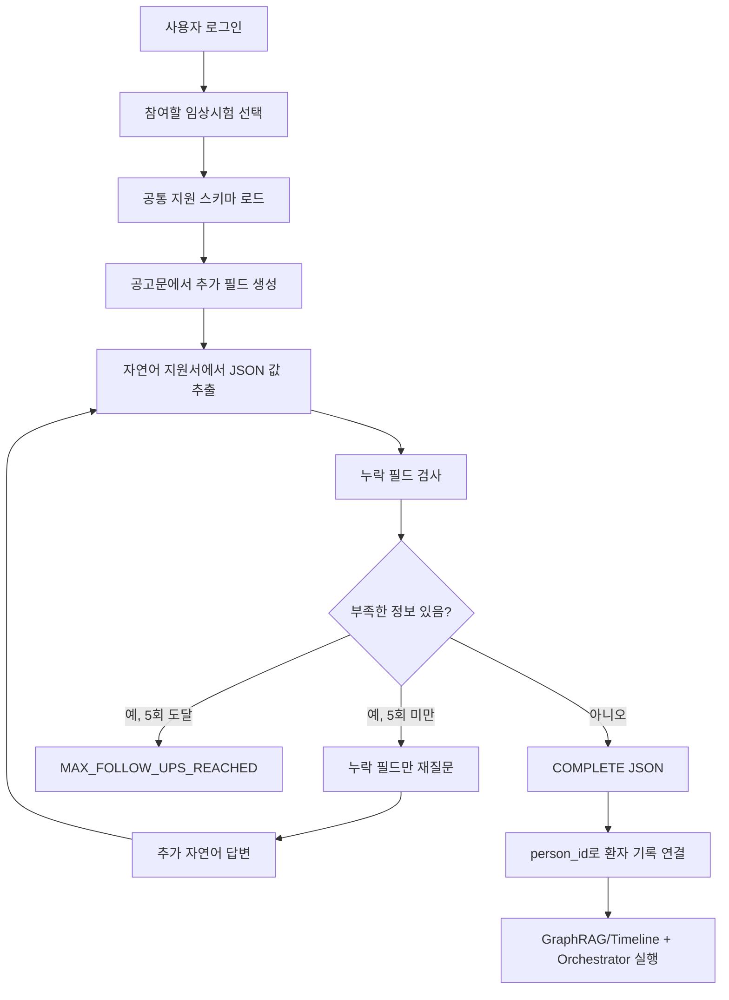
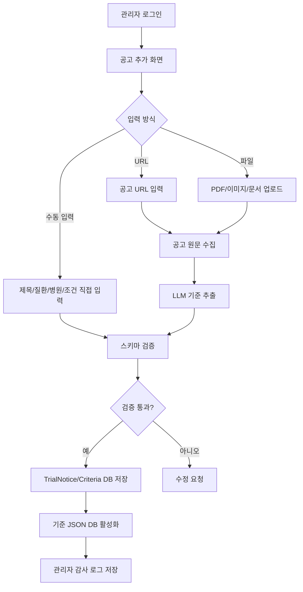
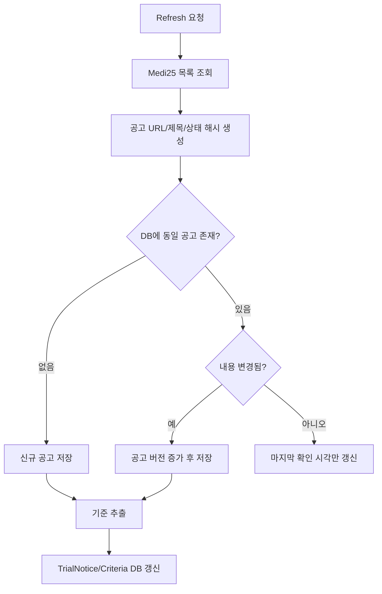
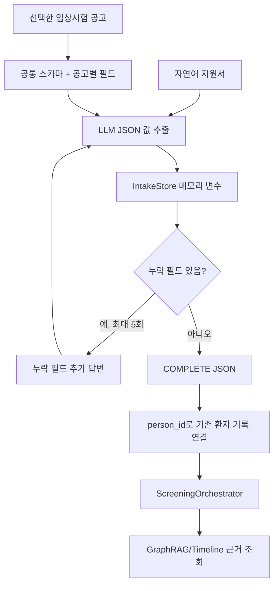
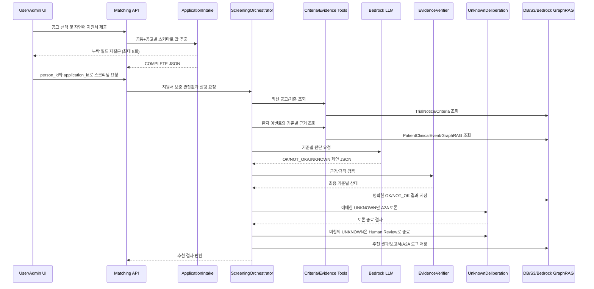
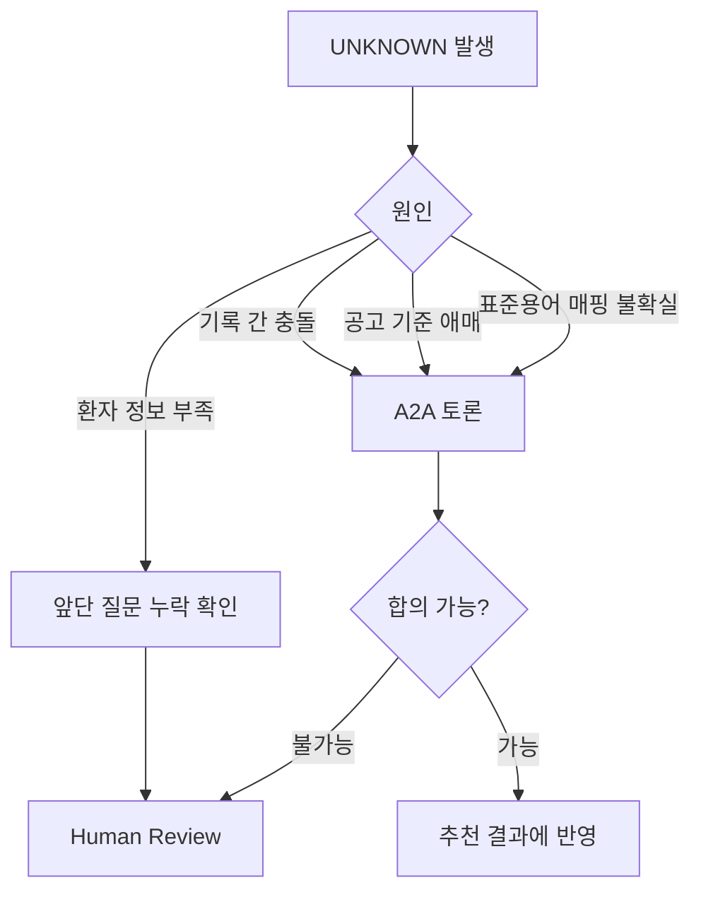

# 임상시험 매칭 모델 v2

## 목적

이 모델은 Medi25에서 가져온 임상시험 모집공고와 사용자의 기본 정보, 환자정보 기입, 추가 설문 데이터를 종합해 사용자에게 가장 적합한 임상시험을 추천한다.

최종 결과는 기준별로 `OK`, `NOT_OK`, `UNKNOWN` 세 가지 상태를 반환한다. 사용자가 선택한 공고에는 공통 지원 스키마를 먼저 적용하고, LLM이 공고별 필드를 추가한다. 자연어 지원서에서 누락된 필드는 최대 5회까지 다시 질문해 완성 JSON을 만든다. 완성 JSON은 기존 환자 기록과 연결되어 GraphRAG/Timeline 조회와 오케스트레이터 판정에 사용된다. 그래도 남는 `UNKNOWN`은 A2A 토론 또는 사람 검토로 넘긴다.

## 전체 모델 흐름



## 시작점과 자동화 관점

전체 워크플로우는 반드시 명확한 시작점이 있어야 한다. 시작점은 사용자가 직접 정보를 입력하는 경우와, 운영자가 최신 모집공고를 갱신하는 경우로 나뉜다.

| 시작 방식 | 트리거 | 목적 |
|-----------|--------|------|
| 사용자 시작 | 로그인 후 프로필/환자정보 입력 | 특정 사용자에게 맞는 임상시험 추천 |
| 운영자 시작 | `Refresh` 버튼 클릭 | Medi25 최신 모집공고 수동 갱신 |
| 관리자 시작 | 공고 직접 추가/수정 | Medi25에 없거나 누락된 모집공고 등록 |
| 자동 시작 | EventBridge/Scheduler | 매일 또는 일정 주기로 최신 공고 자동 수집 |
| 재판정 시작 | 추가 설문 제출 | `UNKNOWN` 기준을 다시 판단 |

초기 화면에서 중요한 버튼은 `Refresh 모집공고`, `공고 추가`, `매칭 시작`이다. `Refresh 모집공고`는 최신 Medi25 데이터를 가져와 DB에 반영하고, `공고 추가`는 관리자가 직접 모집공고를 등록하거나 수정하는 기능이다. `매칭 시작`은 현재 저장된 공고와 사용자 데이터를 기반으로 전체 에이전트 워크플로우를 실행한다.

## 공고 기준 JSON 판정 원칙

수집한 모집공고는 원문을 그대로 LLM에 길게 넣어 판정하지 않고, 먼저 구조화된 JSON으로 정규화한다. 런타임 매칭의 기준 원본은 `TrialCriteriaTable`의 선정/제외 기준 JSON이다.

- `TrialNoticeTable`은 공고 목록, 출처, 상태, 해시, 최신성 정보를 관리한다.
- `TrialCriteriaTable`은 선정/제외 기준 JSON과 `criteria_version`을 관리하며 기준 판정의 Source of Truth가 된다.
- 공고 원문 HTML/PDF/문서는 S3 `trials/raw/`에 보존하고, 감사/재파싱/관리자 검토에만 사용한다.
- RAG/Graph는 공고 기준 원본 저장소가 아니다. 환자 근거, 표준문서, 용어 매핑, 과거 판단 근거를 찾는 보조 계층으로 사용한다.
- 기준 추출 JSON이 불완전하면 런타임에서 Long Context로 다시 판단하지 않고 `PENDING_REVIEW` 또는 `NEEDS_FIX`로 보내 관리자 검토 후 활성화한다.

## 공고 기반 자연어 지원서 모델

지원서 수집은 판정과 분리한다. 먼저 모든 공고에 적용되는 기본 스키마를 만들고, 선택한 공고에서 지원자가 직접 답해야 하는 항목만 LLM이 추가한다. 그다음 사용자의 자연어 지원서에서 스키마 값을 추출한다. 응답하지 않은 값은 누락으로 유지하며, `없음`이라고 명시한 배열형 항목은 유효한 빈 배열 `[]`로 기록한다.

누락 항목이 있으면 해당 항목만 다시 작성하도록 요청한다. 추가 답변은 기존 메모리 변수에 병합하며, 재질문은 최대 5회까지만 발행한다. 모든 필드가 채워지면 `COMPLETE` 상태의 JSON을 반환한다.



공통 필수 필드는 다음과 같다.

| 필드 | 타입 | 병합 방식 |
|------|------|-----------|
| `age` | integer | 최신 명확한 답변으로 교체 |
| `sex` | string | 최신 명확한 답변으로 교체 |
| `diagnosed_conditions` | array | 누적 후 중복 제거, `없음`은 `[]` |
| `current_medications` | array | 누적 후 중복 제거, `없음`은 `[]` |
| `allergies` | array | 누적 후 중복 제거, `없음`은 `[]` |
| `prior_trial_participation` | boolean | `false`도 응답 완료로 인정 |

완성 지원서 JSON 예시:

```json
{
  "application_id": "APP-a17f...",
  "schema_id": "APP-SCHEMA-medi25-10713-a93c...",
  "trial_id": "medi25-10713",
  "status": "COMPLETE",
  "data": {
    "age": 36,
    "sex": "female",
    "diagnosed_conditions": ["제2형 당뇨병"],
    "current_medications": ["메트포르민"],
    "allergies": [],
    "prior_trial_participation": false,
    "latest_hba1c": 7.8
  },
  "missing_fields": [],
  "follow_up_count": 2,
  "max_follow_ups": 5
}
```

재질문 생성 정책:

| 항목 | 정책 |
|------|------|
| 최대 재질문 횟수 | 지원서 세션당 최대 5회 |
| 질문 대상 | 현재 JSON Schema에서 값이 누락된 필드만 |
| 질문 방식 | 누락 필드의 제목과 설명을 포함한 추가 작성 요청 |
| 제외 질문 | 이미 답변한 내용, LLM이 근거 없이 추측한 내용 |
| 병합 방식 | 단일값은 최신 답변, 배열은 누적·중복 제거 |
| 종료 상태 | `COMPLETE` 또는 `MAX_FOLLOW_UPS_REACHED` |
| 보관 방식 | 현재 프로세스의 `IntakeStore` 메모리 변수에 유지 |

재질문 JSON:

```json
{
  "status": "NEEDS_MORE_INFO",
  "missing_fields": [
    {
      "name": "latest_hba1c",
      "title": "최근 HbA1c",
      "description": "가장 최근 HbA1c 검사 결과",
      "type": "number"
    }
  ],
  "follow_up_prompt": "지원서에서 다음 내용이 확인되지 않았습니다: 최근 HbA1c. 해당 내용을 추가로 작성해 주세요.",
  "follow_up_count": 1,
  "max_follow_ups": 5
}
```

한 번의 재질문에는 현재 누락된 필드가 함께 포함된다. 다섯 번째 추가 답변 이후에도 누락이 남으면 `MAX_FOLLOW_UPS_REACHED`로 종료하며 더 이상 질문을 발행하지 않는다.

## 관리자 공고 추가 모델

관리자로 로그인한 사용자는 Medi25 자동 수집 결과와 별개로 모집공고를 직접 추가할 수 있어야 한다. 병원에서 전달받은 공고, 아직 Medi25에 반영되지 않은 공고, PDF/이미지/문서 형태의 모집공고를 등록하기 위한 기능이다.



관리자 입력 필드:

| 필드 | 필수 | 설명 |
|------|------|------|
| `title` | Y | 모집공고 제목 |
| `disease` | Y | 대상 질환 |
| `hospital` | N | 실시 기관 |
| `location` | N | 지역 |
| `recruitment_status` | Y | 모집중/마감/검토중 |
| `age` | N | 나이 조건 |
| `sex` | N | 성별 조건 |
| `inclusion_text` | Y | 선정 기준 원문 |
| `exclusion_text` | N | 제외 기준 원문 |
| `source_type` | Y | `MEDI25`, `ADMIN_URL`, `ADMIN_FILE`, `ADMIN_MANUAL` |
| `source_url` | N | 원문 URL |
| `source_file_id` | N | 업로드 파일 ID |

관리자 추가 공고 상태:

| 상태 | 의미 |
|------|------|
| `DRAFT` | 입력 중 |
| `PENDING_REVIEW` | LLM 추출 결과 검토 대기 |
| `ACTIVE` | 매칭에 사용할 수 있음 |
| `NEEDS_FIX` | 필수값 또는 기준 파싱 오류 |
| `ARCHIVED` | 사용 중지 |

관리자 공고 추가 원칙:

- 관리자가 추가한 공고도 Medi25 공고와 같은 `TrialNoticeTable`, `TrialCriteriaTable`에 저장한다.
- 자동 수집 공고와 구분하기 위해 `source_type`과 `created_by`를 반드시 남긴다.
- LLM이 추출한 선정/제외 기준은 바로 활성화하지 않고 관리자 확인 후 `ACTIVE`로 전환한다.
- 공고 수정 시 기존 기준을 덮어쓰지 않고 `criteria_version`을 증가시킨다.
- 모든 추가/수정/활성화/비활성화 이벤트는 감사 로그에 남긴다.

## 데이터 최신성 확인 모델

자동화 관점에서는 단순히 데이터를 긁어오는 것보다, 이미 수집한 데이터인지, 변경됐는지, 최신인지 확인하는 단계가 필요하다.



공고 수집 시 확인할 값:

- `detail_url`
- `trial_id`
- `title`
- `recruitment_status`
- `content_hash`
- `collected_at`
- `last_checked_at`
- `criteria_version`

## 저장 DB 모델

보고서와 모집공고는 별도 저장소가 필요하다. 공고 원문, 정규화 JSON, 기준 JSON, 매칭 결과 보고서를 분리해서 저장해야 추적과 재판정이 가능하다.

| 데이터 | 저장소 후보 | 설명 |
|--------|-------------|------|
| 공고 원문 HTML/PDF | S3 `trials/raw/` | 원본 보존, 재파싱 가능 |
| 공고 정규화 JSON | DynamoDB `TrialNoticeTable` | 목록 조회, 검색, 상태 관리 |
| 선정/제외 기준 JSON | DynamoDB `TrialCriteriaTable` | 기준 버전 관리, 판정 Source of Truth |
| 표준문서/비식별 근거 문서 | S3 `rag/` + Bedrock KB GraphRAG | 환자 근거와 표준문서 검색용 |
| 지원서 스키마/작성 상태 | 백엔드 메모리 `IntakeStore` | 현재 프로세스에서 스키마와 추가 답변 병합 상태 유지 |
| 완성 지원서 JSON | 백엔드 메모리 변수 | 오케스트레이터 전달 후에도 현재 프로세스에서 유지 |
| 기존 환자 임상 이벤트 | 환자 임상 데이터 저장소 | 정확한 수치·기간 판정용 기존 기록 |
| GraphRAG 관계/벡터 | Bedrock Knowledge Bases + Neptune Analytics | 문서 엔티티·관계 기반 근거 검색 |
| 매칭 실행 결과 | DynamoDB `MatchingRunTable` | 실행 이력, 상태, 재실행 |
| 최종 보고서 | S3 `reports/` + DynamoDB 메타데이터 | 사용자/관리자 조회용 |
| A2A 토론 로그 | DynamoDB 또는 S3 append-only | `UNKNOWN` 판단 근거 보존 |

최소 DB 테이블:

| 테이블 | 키 | 역할 |
|--------|----|------|
| `TrialNoticeTable` | `trial_id` | Medi25 공고 목록과 최신 상태 |
| `TrialCriteriaTable` | `trial_id`, `criteria_version` | 선정/제외 기준 버전 |
| `AdminAuditLogTable` | `event_id` | 관리자 공고 추가/수정/활성화 이력 |
| `UserProfileTable` | `user_id` | 사용자 기본 정보와 관심 임상 |
| `PatientClinicalEventTable` | `patient_key`, `observed_at` | 정규화된 임상 이벤트 |
| `MatchingRunTable` | `run_id` | 매칭 실행 단위 |
| `MatchingReportTable` | `report_id` | 최종 보고서 메타데이터 |

## 지원서 JSON 메모리 처리 모델

현재 구현은 ElastiCache나 별도 TTL 계층을 사용하지 않는다. 지원 스키마와 작성 중인 JSON은 API 프로세스의 `IntakeStore`가 메모리 변수로 보관한다. 추가 답변이 들어오면 같은 `application_id`의 기존 변수에 병합하고, 완성된 뒤에도 다음 로직이 조회할 수 있도록 유지한다.



메모리 변수 사용 원칙:

| 항목 | 정책 |
|------|------|
| 용도 | 지원서 스키마, 현재 값, 재질문 횟수와 상태 유지 |
| 키 | `schema_id`, `application_id` |
| 값 병합 | 단일값은 최신 답변, 배열은 누적 후 중복 제거 |
| 완료 조건 | JSON Schema의 모든 필수 필드가 채워짐 |
| 재질문 제한 | 최대 5회 |
| 완료 후 | 완성 JSON을 오케스트레이터에 전달하고 메모리 값은 유지 |
| 현재 제약 | 서버 재시작 시 소실되며 다중 인스턴스 간 상태를 공유하지 않음 |

오케스트레이터 연결 요청 예시:

```json
{
  "person_id": 12345,
  "actor": "system"
}
```

`POST /api/v1/applications/{application_id}/screening`은 지원서 상태가 `COMPLETE`일 때만 실행된다. 지원서의 스칼라 필드는 `PATIENT_REPORTED` 보충 관찰값으로 바뀌며, 기존 환자 기록에 값이 있으면 기존 기록을 우선한다. 배열 필드는 단일 기준값으로 추측하지 않고 제외 내역에 남긴다. 응답에는 적용·제외 필드, `source_application_id`, 실제 `retrieval_mode`가 포함된다.

## 입력 데이터

### 1. Medi25 공고 데이터

Medi25에서 임상시험 모집공고를 가져온 뒤 표준 JSON으로 변환한다.

```json
{
  "source": "Medi25",
  "trial_id": "medi25-10713",
  "title": "당뇨병 대상 임상시험",
  "disease": ["당뇨병"],
  "status": "RECRUITING",
  "age": "만 19세 이상",
  "sex": "ALL",
  "location": "서울",
  "hospital": "OO병원",
  "visit_schedule": "총 8회 방문",
  "detail_url": "https://www.medi25.com/...",
  "collected_at": "2026-08-04T00:00:00+09:00"
}
```

### 2. 사용자 기본 정보

사용자 로그인 이후 최소한의 정보를 받는다.

```json
{
  "user_id": "user_123",
  "patient_key": "pt_7f3a",
  "name_ref": "pii:user_123:name",
  "sex": "FEMALE",
  "birth_year": 1990,
  "interests": {
    "diseases": ["당뇨병"],
    "trial_types": ["약물", "디지털치료제"],
    "regions": ["서울", "경기"]
  },
    "patient_information_source": "DOCTOR_NOTE"
}
```

이름 같은 직접 식별자는 LLM이나 RAG에 넣지 않는다. LLM에는 `patient_key`처럼 비식별 키만 전달한다.

### 3. 환자정보 정규화 데이터

의사 소견서, 사용자가 직접 입력한 건강 정보, 추가 설문 답변은 모두 같은 임상 이벤트 JSON으로 정규화한다.

```json
{
  "patient_key": "pt_7f3a",
  "event_type": "MEASUREMENT",
  "field": "hba1c",
  "value": 7.8,
  "unit": "%",
  "observed_at": "2026-07-20",
  "source": {
    "type": "DOCTOR_NOTE",
    "document_id": "note_20260720_01",
    "span": "HbA1c 7.8%"
  },
  "confidence": 0.93
}
```

## 모델 구성

## 1. 공고 수집 모델

역할:

- Medi25에서 모집 중인 임상시험 공고를 가져온다.
- 마감, 예약, 홍보성 페이지는 제외한다.
- 공고의 핵심 정보를 표준 JSON으로 만든다.
- 원문 URL과 수집 시점을 보존한다.

출력:

- `trial_notice.json`
- `trial_raw_snapshot`

## 2. 공고 기준 추출 모델

역할:

- Medi25 공고 원문에서 선정 기준과 제외 기준을 추출한다.
- 나이, 성별, 질환, 검사값, 약물, 방문 조건 등을 구조화한다.
- 표준문서와 용어집을 참조해 기준 필드를 정규화한다.

출력:

```json
{
  "trial_id": "medi25-10713",
  "criteria_version": "2026-08-04.1",
  "inclusion": [
    {
      "criterion_id": "inc_hba1c_001",
      "raw_text": "최근 HbA1c 7.0% 이상",
      "field": "hba1c",
      "operator": ">=",
      "value": 7.0,
      "unit": "%",
      "time_window_days": 180
    }
  ],
  "exclusion": [
    {
      "criterion_id": "exc_pregnancy_001",
      "raw_text": "임신 중인 대상자 제외",
      "field": "active_pregnancy",
      "operator": "!=",
      "value": true
    }
  ]
}
```

## 3. 사용자 임상 프로필 모델

역할:

- 로그인한 사용자의 기본 정보와 관심 임상을 저장한다.
- 환자정보 입력 방식과 원문 참조를 관리한다.
- 직접 식별 정보와 임상 판단용 정보를 분리한다.

핵심 원칙:

- LLM에는 이름, 연락처, 주민번호 같은 직접 식별자를 넣지 않는다.
- 성별, 나이대, 관심 질환처럼 매칭에 필요한 정보만 전달한다.
- 동의 범위에 따라 데이터 사용 범위를 제한한다.

## 4. 임상 이벤트 정규화 모델

역할:

- 의사 소견서와 환자정보 입력을 진단, 검사, 약물, 시술, 상태, 이상반응 이벤트로 변환한다.
- 사용자의 직접 입력과 추가 설문 답변도 같은 이벤트 모델로 합친다.
- 날짜, 단위, 코드, 부정 표현은 규칙 기반으로 검증한다.
- 자유서술에서 필요한 후보 정보는 LLM이 추출한다.

이벤트 타입:

| 타입 | 예시 |
|------|------|
| `MEASUREMENT` | HbA1c, 혈압, BMI, eGFR |
| `CONDITION` | 당뇨, 임신 여부, 고혈압 |
| `MEDICATION` | metformin 복용, insulin 중단 |
| `PROCEDURE` | 수술, 검사 |
| `ADVERSE_EVENT` | 저혈당, 어지러움, 두통 |
| `SURVEY_ANSWER` | 추가 설문 답변 |

## 5. Graph RAG 모델

GraphRAG는 Amazon Bedrock Knowledge Bases의 관리형 GraphRAG와 Neptune Analytics를 사용한다. Bedrock이 S3 문서에서 chunk, entity, relationship을 추출하고 벡터와 그래프를 함께 관리한다. 공고 기준은 계속 `TrialCriteriaTable` JSON을 판정 원본으로 사용하며 GraphRAG에 넣지 않는다.

애플리케이션이 관리할 계약:

| 항목 | 계약 |
|------|------|
| 환자 문서 | `rag/patients/{patient_key}.md` 환자별 비식별 Markdown |
| 메타데이터 | 같은 경로의 `.metadata.json`, `patient_key`, `document_type`, `schema_version`, `phi_status` 포함 |
| 환자 격리 | 모든 환자 근거 검색은 `patient_key` metadata filter 필수 |
| 근거 참조 | 원본 방문 ID 대신 HMAC 기반 `event_key`를 문서에 기록 |
| 구조화 판정 | 수치, 단위, 기간은 `PatientClinicalEventTable`에서 결정론적으로 조회 |
| 그래프 구성 | Bedrock이 entity/relation을 자동 추출하며 사용자 정의 노드/엣지 스키마에 의존하지 않음 |

사용 AWS:

- Amazon Bedrock Knowledge Bases GraphRAG: 문서 수집, entity/relation 추출, 검색
- Amazon Neptune Analytics: Bedrock이 관리하는 그래프와 벡터 저장소
- Amazon Titan Text Embeddings v2: 1,024차원 임베딩
- Amazon Nova: GraphRAG ingestion 시 chunk entity extraction
- S3: 환자별 비식별 Markdown과 metadata sidecar 저장

## 6. 최소 에이전트 모델

DB 조회나 API 호출마다 에이전트를 만들지 않는다. 실행 순서 제어는 Orchestrator Runtime이 담당하고, 데이터 접근과 규칙 계산은 최소 권한 Tool로 둔다. LLM 추론이 필요한 역할만 에이전트로 유지한다.

| 구성 요소 | 분류 | 역할 |
|----------|------|------|
| `ScreeningOrchestrator` | Runtime | 전체 실행 순서, Tool Gateway, 감사 로그 제어 |
| `IntakeAgent` | Agent | 환자 자유 입력을 임상 이벤트 후보로 정규화 |
| `EvidenceGatheringAgent` | Agent | 부족한 근거에 필요한 RAG/타임라인 Tool 호출 계획 |
| `CriterionJudgeAgent` | Agent | 공고 기준과 근거를 비교해 `OK`, `NOT_OK`, `UNKNOWN` 제안 |
| `EvidenceVerifier` | Agent | Judge 제안의 출처·시점·단위·규칙 일치 여부 검증 |
| `ApplicationIntake` | Service | 지원 스키마 생성, 자연어 값 추출·병합, 누락 필드 최대 5회 재질문 |
| `UnknownDeliberation` | Agent | `UNKNOWN`을 2라운드 교차 검토하고 추천 생성 |
| `ResultExplanationAgent` | Agent | 추천 결과와 사전 부적합 사유를 대상별로 설명 |
| 공고·기준 조회 | Tool | `get_trial_notice`, `get_trial_criteria` |
| 환자 근거 조회 | Tool | `evidence_retrieval_tool`, `timeline_graph_tool` |
| 규칙 평가 | Tool | `rule_evaluator` |

제거한 역할:

- `NoticeAgent`, `CriteriaAgent`: Source of Truth JSON을 읽는 결정론적 Tool로 충분하다.
- `RagAgent`, `MedicalRecordAgent`: `EvidenceGatheringAgent`가 두 조회 Tool을 선택 호출한다.
- `RejectionReasonAgent`: `ResultExplanationAgent`와 출력 책임이 중복된다.

### 에이전트 오케스트레이션 상세

오케스트레이터는 한 번에 LLM에게 모든 판단을 맡기지 않는다. 먼저 어떤 데이터가 최신인지 확인하고, 후보 공고를 좁힌 뒤, 기준별로 필요한 도구를 호출한다.



오케스트레이션 단계:

1. 선택 공고에 공통 지원 스키마와 공고별 추가 필드를 합쳐 버전을 고정한다.
2. 자연어 지원서와 추가 답변을 메모리 변수에 병합하며 누락 필드를 최대 5회 재질문한다.
3. `COMPLETE` 지원서를 `person_id`로 기존 환자 기록과 연결한다.
4. 지원서 스칼라 필드를 `PATIENT_REPORTED` 보충 관찰값으로 변환한다.
5. `run_id`를 만들고 해당 공고의 최신 선정/제외 기준 버전을 가져온다.
6. Timeline Tool에서 기존 구조화 임상 이벤트를 조회하고, 기존 기록에 값이 없을 때만 지원서 보충값을 적용한다.
7. 자유서술 근거가 필요한 기준은 GraphRAG `evidence_retrieval_tool`로 환자 근거를 조회한다.
8. Bedrock LLM이 기준별 상태를 제안한다.
9. Verifier가 근거 출처, 날짜, 단위, 기준 연산자를 검증한다.
10. 남은 `UNKNOWN` 중 애매한 기준만 A2A 토론으로 넘긴다.
11. A2A는 제한 라운드 안에서 종료하고, 토론 결과를 추천 또는 사람 검토에 반영한다.
12. 결과 JSON, 지원서 연결 메타데이터와 감사 이벤트를 저장한다.

### 에이전트 Tool 계약

LLM이 직접 DB를 읽는 것이 아니라, 허용된 Tool을 통해서만 근거를 가져온다.

| Tool | 입력 | 출력 |
|------|------|------|
| `refresh_trial_notices` | `keyword`, `force_refresh` | 신규/변경 공고 목록 |
| `get_trial_notice` | `trial_id` | 공고 정규화 JSON |
| `get_trial_criteria` | `trial_id`, `criteria_version` | 선정/제외 기준 JSON |
| `evidence_retrieval_tool` | `ToolContext`, `terms`, `top_k` | 환자별 자유서술 근거 문장 목록 |
| `timeline_graph_tool` | `ToolContext`, `fields` | 구조화 임상 관찰값 |
| `rule_evaluator` | `ToolContext`, `rule`, `observation` | 규칙 기반 판정 |
| `save_matching_report` | `run_id`, `result_json` | 보고서 저장 위치 |
| `POST /api/v1/application-schemas` | 공고문 또는 추가 필드 | 버전 고정 지원 JSON Schema |
| `POST /api/v1/applications` | `schema_id`, 자연어 지원서 | 최초 추출값과 누락 필드 질문 |
| `POST /api/v1/applications/{id}/responses` | 추가 자연어 답변 | 병합된 값과 다음 누락 필드 질문 |
| `POST /api/v1/applications/{id}/screening` | `person_id`, `actor` | GraphRAG 오케스트레이터 실행 결과 |

Tool 호출 권한:

- `ScreeningOrchestrator`만 Gateway를 통해 공고 기준 Tool과 저장 Tool을 호출한다.
- `EvidenceGatheringAgent`에는 환자 근거 RAG와 비식별 임상 이벤트 조회 Tool만 노출한다.
- 지원서 재질문은 `ApplicationIntake`가 현재 스키마의 누락 필드만 대상으로 최대 5회 발행한다.
- `EvidenceVerifier`와 `UnknownDeliberation`은 조립된 근거 번들만 읽으며 DB Tool이나 원본 개인정보에 접근하지 않는다.

## 7. 판단 모델

각 임상시험 기준은 다음 세 가지 상태 중 하나로 판정한다.

| 상태 | 의미 |
|------|------|
| `OK` | 기준을 충족한다 |
| `NOT_OK` | 기준을 충족하지 못하거나 제외 기준에 걸린다 |
| `UNKNOWN` | 정보가 부족하거나 판단이 애매하다 |

판정 규칙:

- 선정 기준이 `OK`이면 통과 후보로 본다.
- 선정 기준이 `NOT_OK`이면 추천 점수를 크게 낮추거나 제외한다.
- 제외 기준이 `NOT_OK`이면 해당 임상시험은 제외한다.
- 부족한 지원서 필드는 매칭 실행 전에 최대 5회 재질문으로 먼저 보완한다.
- 매칭 이후 남은 `UNKNOWN`은 A2A 토론 또는 사람 검토로 해소한다.
- A2A는 재귀적으로 Verifier를 다시 호출하지 않고, 제한 라운드 후 추천 반영 또는 사람 검토로 종료한다.

### LLM 판단 방식

LLM은 최종 판정을 단독으로 확정하지 않고, 기준별 상태를 제안한다. 최종 확정은 `VerifierAgent`와 규칙 평가기가 담당한다.

LLM 입력:

```json
{
  "task": "evaluate_trial_criterion",
  "patient_key": "pt_7f3a",
  "trial": {
    "trial_id": "medi25-10713",
    "title": "당뇨병 대상 임상시험"
  },
  "criterion": {
    "criterion_id": "inc_hba1c_001",
    "type": "INCLUSION",
    "raw_text": "최근 HbA1c 7.0% 이상",
    "field": "hba1c",
    "operator": ">=",
    "value": 7.0,
    "unit": "%",
    "time_window_days": 180
  },
  "evidence": [
    {
      "evidence_id": "patient.note_20260720_01",
      "source_type": "DOCTOR_NOTE",
      "observed_at": "2026-07-20",
      "text": "HbA1c 7.8%",
      "structured_value": 7.8,
      "unit": "%"
    }
  ],
  "allowed_status": ["OK", "NOT_OK", "UNKNOWN"]
}
```

LLM 출력:

```json
{
  "criterion_id": "inc_hba1c_001",
  "proposed_status": "OK",
  "confidence": 0.91,
  "reason": "최근 180일 이내 HbA1c 7.8% 근거가 있어 기준을 충족합니다.",
  "used_evidence_ids": ["patient.note_20260720_01"],
  "missing_information": [],
  "needs_a2a": false
}
```

Verifier 검증 항목:

| 검증 항목 | 설명 |
|-----------|------|
| 근거 존재 | `used_evidence_ids`가 실제 검색 결과에 존재하는가 |
| 시간 범위 | 검사일/관찰일이 기준의 기간 조건 안에 있는가 |
| 단위 | HbA1c `%`, 혈당 `mg/dL`처럼 단위가 맞는가 |
| 연산자 | `>=`, `<=`, `between`, `exists` 조건이 맞게 적용됐는가 |
| 기준 유형 | 선정 기준과 제외 기준의 의미가 뒤집히지 않았는가 |
| 개인정보 | 출력에 직접 식별 정보가 포함되지 않았는가 |
| 신뢰도 | 낮은 confidence는 `UNKNOWN` 또는 Human Review로 보낼 것인가 |

최종 상태 확정 규칙:

| 상황 | 최종 상태 |
|------|-----------|
| LLM 제안이 `OK`이고 규칙 검증도 통과 | `OK` |
| LLM 제안이 `NOT_OK`이고 충돌 근거가 명확 | `NOT_OK` |
| 근거가 없거나 날짜/단위가 부족 | `UNKNOWN` |
| LLM 제안과 규칙 결과가 충돌 | A2A 토론 대상으로 분류 |
| A2A 합의 가능 | 토론 결과를 추천 점수와 별도 추천 상태에 반영하되 규칙 상태는 보존 |
| A2A 후에도 합의 불가 | Human Review |

## UNKNOWN 처리 모델



추가 질문 예시:

```json
{
  "question_id": "q_pregnancy_001",
  "criterion_id": "exc_pregnancy_001",
  "reason": "최근 임신 여부를 확인할 근거가 없습니다.",
  "question": "현재 임신 중이거나 임신 가능성이 있나요?",
  "answer_type": "YES_NO"
}
```

## A2A 토론 모델

A2A는 같은 `UNKNOWN` 기준을 두 역할이 교차 검토하는 구조다. 구현은 기준 수 최대 5개, 총 2라운드로 고정한다. 첫 번째 Bedrock 호출은 독립 근거 검토, 두 번째 호출은 반론 검토를 수행한다. 세 번째 LLM 심판은 두지 않고 결정론적 합의기가 결과를 정리한다.

| 역할 | 관점 |
|------|------|
| `EvidenceReviewer` | 공고 기준과 환자 근거를 독립적으로 비교 |
| `ChallengeReviewer` | 첫 검토를 그대로 따르지 않고 출처·시점·단위·충돌을 재검토 |
| 결정론적 합의기 | 두 추천과 실제 `source_id`를 검사해 `OK`, `NOT_OK`, `UNKNOWN` 추천 생성 |

A2A 결과:

```json
{
  "criterion_id": "exc_pregnancy_001",
  "recommendation": "UNKNOWN",
  "agreement": true,
  "grounded": false,
  "advocate": "UNKNOWN",
  "skeptic": "UNKNOWN",
  "source_ids": []
}
```

A2A 종료 규칙:

| 조건 | 종료 처리 |
|------|-----------|
| 두 역할이 `OK` 또는 `NOT_OK`로 합의하고 실제 출처 ID를 인용 | 토론 추천에 반영하되 규칙의 최종 기준 상태는 덮어쓰지 않음 |
| 근거는 부족하지만 치명적 제외 기준은 아님 | `UNKNOWN`으로 남기고 추천 결과에 불확실성 표시 |
| 제외 기준 가능성이 있는데 근거 부족 | Human Review Queue |
| 두 역할이 불일치하거나 출처 ID가 유효하지 않음 | `UNKNOWN` 유지 후 질문 또는 Human Review |

토론은 Verifier로 돌아가지 않는다. 두 모델 호출이 끝나면 항상 종료하며 토론 추천과 최종 규칙 판정을 분리해 저장한다.

구현 상한은 공고당 최대 5개 기준, 정확히 2라운드다. 검토 우선순위는
`REVIEW_REQUIRED` → `CONFLICTING` → 제외 기준 `UNKNOWN` → 나머지 `UNKNOWN`이다.
두 역할의 결론이 같고 입력에 존재하는 `source_id`를 인용한 경우만 합의로 인정한다.

## 최종 추천 결과

```json
{
  "run_id": "run_20260804_001",
  "patient_key": "pt_7f3a",
  "recommended_trials": [
    {
      "trial_id": "medi25-10713",
      "title": "당뇨병 대상 임상시험",
      "rank_score": 0.78,
      "overall_status": "NEEDS_MORE_INFO",
      "criteria": [
        {
          "criterion_id": "inc_age_001",
          "status": "OK",
          "reason": "나이 기준을 충족합니다.",
          "evidence_ids": ["profile.birth_year"]
        },
        {
          "criterion_id": "inc_hba1c_001",
          "status": "OK",
          "reason": "최근 HbA1c 7.8%가 확인되었습니다.",
          "evidence_ids": ["patient.note_20260720_01"]
        },
        {
          "criterion_id": "exc_pregnancy_001",
          "status": "UNKNOWN",
          "reason": "최근 임신 여부 근거가 없습니다.",
          "next_question": "현재 임신 중이거나 임신 가능성이 있나요?"
        }
      ]
    }
  ]
}
```

현재 API 계약:

| Method | Path | 역할 |
|--------|------|------|
| `POST` | `/api/v1/recommendations/run` | 선택한 공고 또는 전체 공고를 판정하고 상위 후보 반환 |
| `GET` | `/api/v1/recommendations/{recommendation_id}` | 저장된 추천 JSON 재조회 |

정렬 규칙은 `OK` → `UNKNOWN` → `NOT_OK` 순서다. `NOT_OK`는
`excluded_trials`로 분리하고 추천 목록에 넣지 않는다. 같은 판정 안에서는 기준별
결정론적 점수 평균을 사용하며, A2A 합의는 실제 출처로 그라운딩된 경우만 반영한다.
따라서 모델 응답 순서나 모델이 임의 생성한 숫자가 최종 순위를 결정하지 않는다.
API는 규칙의 `screening_decision`과 A2A를 반영한 `recommendation_decision`을
분리해 반환한다. A2A `NOT_OK` 합의는 추천에서 제외할 수 있지만 규칙 판정 이력은
`UNKNOWN` 그대로 보존된다.

## Amazon Bedrock 사용 계획

| 기능 | Bedrock 사용 |
|------|--------------|
| 공고 기준 추출 | Bedrock Converse API |
| 공고별 지원 스키마 필드 생성 | Bedrock Converse API |
| 자연어 지원서 JSON 값 추출 | Bedrock Converse API |
| 누락 필드 재질문 | 백엔드 규칙이 누락 필드 목록으로 생성, 최대 5회 |
| RAG 검색/그래프 | Bedrock Knowledge Bases GraphRAG + Neptune Analytics |
| 임베딩 | Amazon Titan Text Embeddings v2 |
| 그래프 구성 | Amazon Nova 기반 chunk entity extraction |
| 안전장치 | Bedrock Guardrails |
| 에이전트 오케스트레이션 | 자체 `ScreeningOrchestrator` + Tool Gateway |

## 구현 우선순위

1. Medi25 공고 JSON 스키마 확정
2. 임상시험 기준 JSON 스키마 확정
3. 공통+공고별 지원 JSON Schema 구현 (완료)
4. 자연어 값 추출·누락 필드 최대 5회 재질문 구현 (완료)
5. 완성 지원서 메모리 유지와 오케스트레이터 연결 API 구현 (완료)
6. 지원서 필드 → `PATIENT_REPORTED` 보충 관찰값 변환 구현 (완료)
7. `OK`, `NOT_OK`, `UNKNOWN` 판정 규칙 정의
8. 환자별 GraphRAG 문서/metadata 및 검색 필터 계약 정의
9. Bedrock tool-use 에이전트 계약 정의
10. A2A 토론 결과 JSON 구현 (완료: 최대 5개 기준, 2라운드)
11. 최종 추천 결과 API 구현 (완료: 실행·저장·재조회)

## 설계 원칙

- LLM은 판단을 돕지만, 근거 없는 결론을 내리지 않는다.
- 모든 판정은 JSON 근거와 출처 ID를 남긴다.
- 개인정보와 임상 판단용 데이터는 분리한다.
- `UNKNOWN`은 실패가 아니라 추가 정보 수집 상태다.
- A2A는 애매한 판단을 줄이는 검증 절차다.
- 같은 입력과 같은 기준 버전에서는 같은 결과가 나와야 한다.
