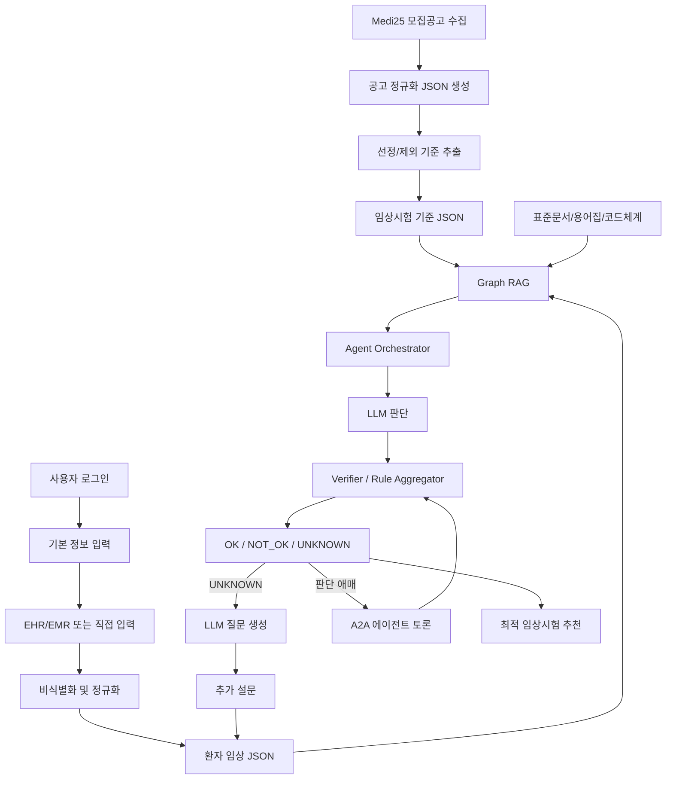
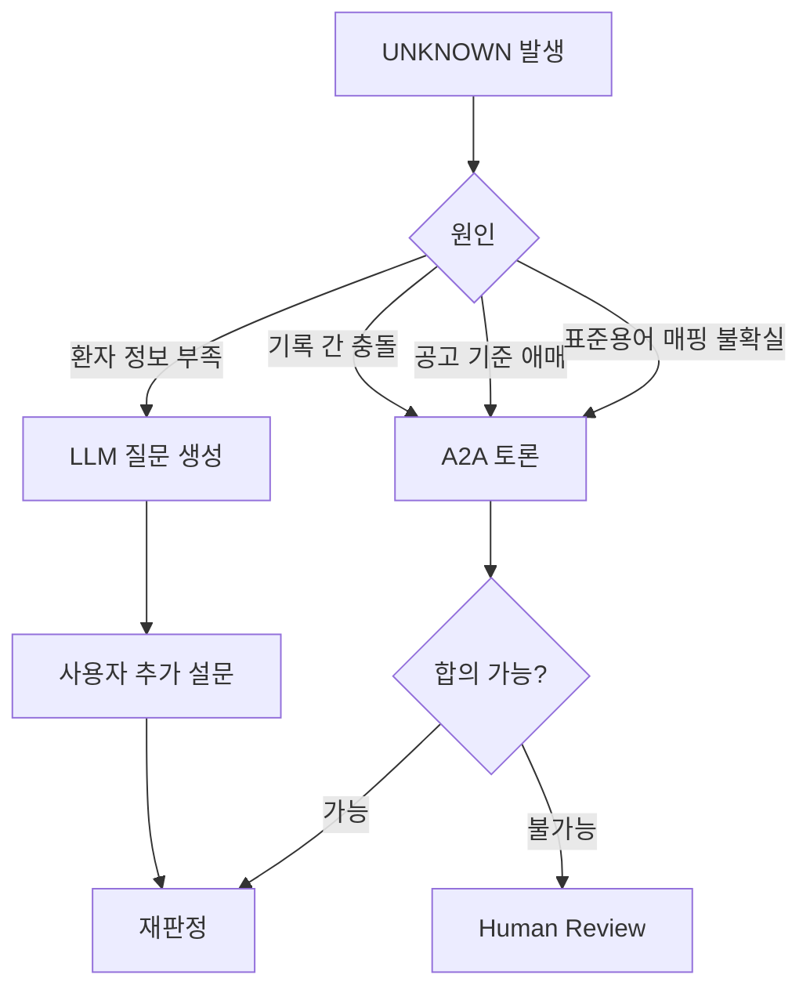

# 임상시험 매칭 모델 v2

## 목적

이 모델은 Medi25에서 가져온 임상시험 모집공고와 사용자의 기본 정보, EHR/EMR, 추가 설문 데이터를 종합해 사용자에게 가장 적합한 임상시험을 추천한다.

최종 결과는 기준별로 `OK`, `NOT_OK`, `UNKNOWN` 세 가지 상태를 반환한다. `UNKNOWN`은 정보가 부족하거나 근거가 애매한 상태이며, LLM 질문 생성과 A2A 토론을 통해 다시 판단한다.

## 전체 모델 흐름



## 입력 데이터

### 1. Medi25 공고 데이터

Medi25에서 임상시험 모집공고를 가져온 뒤 표준 JSON으로 변환한다.

```json
{
  "source": "Medi25",
  "trial_id": "medi25-10713",
  "title": "당뇨병 대상 임상시험",
  "disease": ["당뇨병"],
  "status": "RECRUITING",
  "age": "만 19세 이상",
  "sex": "ALL",
  "location": "서울",
  "hospital": "OO병원",
  "visit_schedule": "총 8회 방문",
  "detail_url": "https://www.medi25.com/...",
  "collected_at": "2026-08-04T00:00:00+09:00"
}
```

### 2. 사용자 기본 정보

사용자 로그인 이후 최소한의 정보를 받는다.

```json
{
  "user_id": "user_123",
  "patient_key": "pt_7f3a",
  "name_ref": "pii:user_123:name",
  "sex": "FEMALE",
  "birth_year": 1990,
  "interests": {
    "diseases": ["당뇨병"],
    "trial_types": ["약물", "디지털치료제"],
    "regions": ["서울", "경기"]
  },
  "ehr_emr_connected": true
}
```

이름 같은 직접 식별자는 LLM이나 RAG에 넣지 않는다. LLM에는 `patient_key`처럼 비식별 키만 전달한다.

### 3. EHR/EMR 정규화 데이터

EHR/EMR, 사용자가 직접 입력한 건강 정보, 추가 설문 답변은 모두 같은 임상 이벤트 JSON으로 정규화한다.

```json
{
  "patient_key": "pt_7f3a",
  "event_type": "MEASUREMENT",
  "field": "hba1c",
  "value": 7.8,
  "unit": "%",
  "observed_at": "2026-07-20",
  "source": {
    "type": "EMR",
    "document_id": "note_20260720_01",
    "span": "HbA1c 7.8%"
  },
  "confidence": 0.93
}
```

## 모델 구성

## 1. 공고 수집 모델

역할:

- Medi25에서 모집 중인 임상시험 공고를 가져온다.
- 마감, 예약, 홍보성 페이지는 제외한다.
- 공고의 핵심 정보를 표준 JSON으로 만든다.
- 원문 URL과 수집 시점을 보존한다.

출력:

- `trial_notice.json`
- `trial_raw_snapshot`

## 2. 공고 기준 추출 모델

역할:

- Medi25 공고 원문에서 선정 기준과 제외 기준을 추출한다.
- 나이, 성별, 질환, 검사값, 약물, 방문 조건 등을 구조화한다.
- 표준문서와 용어집을 참조해 기준 필드를 정규화한다.

출력:

```json
{
  "trial_id": "medi25-10713",
  "criteria_version": "2026-08-04.1",
  "inclusion": [
    {
      "criterion_id": "inc_hba1c_001",
      "raw_text": "최근 HbA1c 7.0% 이상",
      "field": "hba1c",
      "operator": ">=",
      "value": 7.0,
      "unit": "%",
      "time_window_days": 180
    }
  ],
  "exclusion": [
    {
      "criterion_id": "exc_pregnancy_001",
      "raw_text": "임신 중인 대상자 제외",
      "field": "active_pregnancy",
      "operator": "!=",
      "value": true
    }
  ]
}
```

## 3. 사용자 임상 프로필 모델

역할:

- 로그인한 사용자의 기본 정보와 관심 임상을 저장한다.
- EHR/EMR 연결 여부를 관리한다.
- 직접 식별 정보와 임상 판단용 정보를 분리한다.

핵심 원칙:

- LLM에는 이름, 연락처, 주민번호 같은 직접 식별자를 넣지 않는다.
- 성별, 나이대, 관심 질환처럼 매칭에 필요한 정보만 전달한다.
- 동의 범위에 따라 데이터 사용 범위를 제한한다.

## 4. 임상 이벤트 정규화 모델

역할:

- EHR/EMR 기록을 진단, 검사, 약물, 시술, 상태, 이상반응 이벤트로 변환한다.
- 사용자의 직접 입력과 추가 설문 답변도 같은 이벤트 모델로 합친다.
- 날짜, 단위, 코드, 부정 표현은 규칙 기반으로 검증한다.
- 자유서술에서 필요한 후보 정보는 LLM이 추출한다.

이벤트 타입:

| 타입 | 예시 |
|------|------|
| `MEASUREMENT` | HbA1c, 혈압, BMI, eGFR |
| `CONDITION` | 당뇨, 임신 여부, 고혈압 |
| `MEDICATION` | metformin 복용, insulin 중단 |
| `PROCEDURE` | 수술, 검사 |
| `ADVERSE_EVENT` | 저혈당, 어지러움, 두통 |
| `SURVEY_ANSWER` | 추가 설문 답변 |

## 5. Graph RAG 모델

RAG는 그래프 기반으로 구축한다. 단순 문서 검색이 아니라 환자, 임상 이벤트, 공고 기준, 표준문서를 그래프로 연결한다.

그래프 노드:

| 노드 | 설명 |
|------|------|
| `Patient` | 비식별 환자 |
| `UserProfile` | 관심 임상, 지역, 기본 정보 |
| `ClinicalEvent` | 검사, 진단, 약물, 설문 답변 |
| `Trial` | Medi25 임상시험 공고 |
| `Criterion` | 선정/제외 기준 |
| `StandardConcept` | ICD, LOINC, ATC, 내부 용어 |
| `EvidenceDocument` | EMR 문장, 공고 원문, 표준문서 chunk |

그래프 관계:

| 관계 | 설명 |
|------|------|
| `HAS_PROFILE` | 사용자가 프로필을 가짐 |
| `HAS_EVENT` | 환자가 임상 이벤트를 가짐 |
| `MATCHES_CONCEPT` | 이벤트가 표준 개념에 매핑됨 |
| `HAS_CRITERION` | 임상시험이 기준을 가짐 |
| `REQUIRES` | 기준이 특정 임상 조건을 요구 |
| `SUPPORTED_BY` | 판정이 근거에 의해 지지됨 |
| `CONTRADICTED_BY` | 판정이 근거와 충돌함 |

사용 AWS:

- Amazon Neptune: 환자 타임라인 및 기준 그래프
- Bedrock Knowledge Bases: 비식별 문서 검색
- OpenSearch Serverless: 벡터/키워드 검색
- S3: 원문 및 정규화 데이터 저장

## 6. 에이전트 모델

에이전트는 RAG, 공고 API, 진료기록 판단을 조합한다.

| 에이전트 | 역할 |
|----------|------|
| `OrchestratorAgent` | 전체 실행 순서 제어 |
| `NoticeAgent` | Medi25 공고 API/크롤러 결과 조회 |
| `CriteriaAgent` | 공고 기준 해석 |
| `RagAgent` | Graph RAG와 표준문서 검색 |
| `MedicalRecordAgent` | EHR/EMR 근거 판단 |
| `QuestionAgent` | 부족한 정보에 대한 질문 생성 |
| `DebateAgent` | `UNKNOWN` 기준에 대해 A2A 토론 |
| `VerifierAgent` | 모델 판단 검증 및 최종 상태 확정 |

## 7. 판단 모델

각 임상시험 기준은 다음 세 가지 상태 중 하나로 판정한다.

| 상태 | 의미 |
|------|------|
| `OK` | 기준을 충족한다 |
| `NOT_OK` | 기준을 충족하지 못하거나 제외 기준에 걸린다 |
| `UNKNOWN` | 정보가 부족하거나 판단이 애매하다 |

판정 규칙:

- 선정 기준이 `OK`이면 통과 후보로 본다.
- 선정 기준이 `NOT_OK`이면 추천 점수를 크게 낮추거나 제외한다.
- 제외 기준이 `NOT_OK`이면 해당 임상시험은 제외한다.
- `UNKNOWN`은 추가 질문 또는 A2A 토론으로 해소한다.
- A2A 후에도 해결되지 않으면 사람 검토 큐로 보낸다.

## UNKNOWN 처리 모델



추가 질문 예시:

```json
{
  "question_id": "q_pregnancy_001",
  "criterion_id": "exc_pregnancy_001",
  "reason": "최근 임신 여부를 확인할 근거가 없습니다.",
  "question": "현재 임신 중이거나 임신 가능성이 있나요?",
  "answer_type": "YES_NO"
}
```

## A2A 토론 모델

A2A는 여러 역할의 에이전트가 같은 `UNKNOWN` 기준을 다른 관점에서 검토하는 구조다.

| 역할 | 관점 |
|------|------|
| `EvidenceAgent` | 환자 근거가 실제로 존재하는가 |
| `CriteriaAgent` | 공고 기준 해석이 맞는가 |
| `StandardAgent` | 표준문서/용어 매핑이 맞는가 |
| `SkepticAgent` | 시간 범위, 단위, 근거 부족 문제가 있는가 |
| `JudgeAgent` | 토론 결과를 정리하고 다음 액션을 결정 |

A2A 결과:

```json
{
  "debate_id": "debate_001",
  "criterion_id": "exc_pregnancy_001",
  "initial_status": "UNKNOWN",
  "final_recommendation": "ASK_USER",
  "agents": [
    {
      "role": "EvidenceAgent",
      "claim": "최근 임신 여부 기록이 없습니다.",
      "confidence": 0.82
    },
    {
      "role": "SkepticAgent",
      "claim": "기록 부재만으로 임신 아님을 확정할 수 없습니다.",
      "confidence": 0.91
    }
  ],
  "question": "현재 임신 중이거나 임신 가능성이 있나요?"
}
```

## 최종 추천 결과

```json
{
  "run_id": "run_20260804_001",
  "patient_key": "pt_7f3a",
  "recommended_trials": [
    {
      "trial_id": "medi25-10713",
      "title": "당뇨병 대상 임상시험",
      "rank_score": 0.78,
      "overall_status": "NEEDS_MORE_INFO",
      "criteria": [
        {
          "criterion_id": "inc_age_001",
          "status": "OK",
          "reason": "나이 기준을 충족합니다.",
          "evidence_ids": ["profile.birth_year"]
        },
        {
          "criterion_id": "inc_hba1c_001",
          "status": "OK",
          "reason": "최근 HbA1c 7.8%가 확인되었습니다.",
          "evidence_ids": ["emr.note_20260720_01"]
        },
        {
          "criterion_id": "exc_pregnancy_001",
          "status": "UNKNOWN",
          "reason": "최근 임신 여부 근거가 없습니다.",
          "next_question": "현재 임신 중이거나 임신 가능성이 있나요?"
        }
      ]
    }
  ]
}
```

## Amazon Bedrock 사용 계획

| 기능 | Bedrock 사용 |
|------|--------------|
| 공고 기준 추출 | Bedrock Converse API |
| EMR 자유서술 해석 | Bedrock Converse API |
| 질문 생성 | Bedrock Converse API |
| RAG 검색 | Bedrock Knowledge Bases |
| 임베딩 | Amazon Titan Embeddings |
| 안전장치 | Bedrock Guardrails |
| 에이전트 오케스트레이션 | Bedrock Agents 또는 자체 Orchestrator |

## 구현 우선순위

1. Medi25 공고 JSON 스키마 확정
2. 사용자 프로필 JSON 스키마 확정
3. EHR/EMR 임상 이벤트 JSON 스키마 확정
4. 임상시험 기준 JSON 스키마 확정
5. `OK`, `NOT_OK`, `UNKNOWN` 판정 규칙 정의
6. Graph RAG 노드/엣지 모델 정의
7. Bedrock tool-use 에이전트 계약 정의
8. `UNKNOWN` 질문 생성 모델 구현
9. A2A 토론 결과 JSON 구현
10. 최종 추천 결과 API 구현

## 설계 원칙

- LLM은 판단을 돕지만, 근거 없는 결론을 내리지 않는다.
- 모든 판정은 JSON 근거와 출처 ID를 남긴다.
- 개인정보와 임상 판단용 데이터는 분리한다.
- `UNKNOWN`은 실패가 아니라 추가 정보 수집 상태다.
- A2A는 애매한 판단을 줄이는 검증 절차다.
- 같은 입력과 같은 기준 버전에서는 같은 결과가 나와야 한다.
